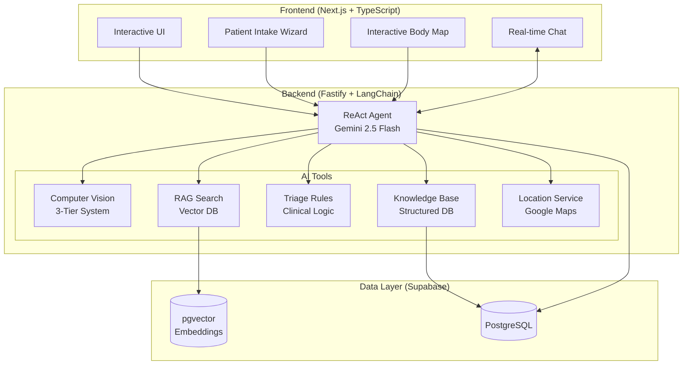

# 🏥 Medagen - AI Medical Triage Assistant

**Intelligent, accessible, and transparent medical triage powered by AI**

🏆 **3rd Place Winner** - GDG Devfest Central Vietnam 2024 | Hack for a Rising Vietnam

[](package.json)
[]()

[🌐 Live Demo](https://medagen.vercel.app/) | [📹 Video Demo](./video_demo.mp4) | [📚 Full Documentation](./docs/README.md) | [🔧 API Docs](http://localhost:7860/docs)

---

## 📋 Table of Contents

- [Overview](#-overview)
- [Key Features](#-key-features)
- [Demo](#-demo--screenshots)
- [Architecture](#️-architecture-overview)
- [Quick Start](#-quick-start)
- [Tech Stack](#️-tech-stack)
- [Documentation](#-documentation)
- [API Reference](#-api-reference)
- [Project Status & Roadmap](#-project-status--roadmap)
- [Contributing](#-contributing)
- [Testing](#-testing)
- [Deployment](#-deployment)
- [License & Credits](#-license--credits)
- [Support](#-support--contact)

---

## 🌟 Overview

### What is Medagen?

Medagen is an **AI-powered medical triage assistant** designed to democratize healthcare access in Vietnam and emerging markets. By combining cutting-edge AI technology with culturally-adapted medical guidelines, Medagen helps users understand the urgency of their symptoms and find appropriate care—anytime, anywhere.

### The Problem We Solve

Healthcare accessibility in Vietnam and similar emerging markets faces critical challenges:

- **Rural-Urban Gap**: 70% of doctors are concentrated in urban centers, leaving rural populations hours away from medical care
- **Overcrowded Facilities**: Major hospitals operate at 200-300% capacity with 3-4 hour wait times
- **High Costs**: Consultation fees of $5-15 are significant for families earning $100-200/month
- **Information Barriers**: Low medical literacy and language barriers make symptom interpretation difficult

### Our Solution

Medagen provides:

✅ **Free, 24/7 AI triage** accessible on any smartphone  
✅ **Visual symptom input** through interactive body maps and image uploads  
✅ **Transparent reasoning** using the ReAct framework to show AI's thought process  
✅ **Culturally-adapted guidelines** from Vietnam's Ministry of Health (Bộ Y Tế)  
✅ **Multi-source validation** combining Computer Vision, RAG, and clinical rules  

**Learn more about our problem statement and solution approach**: [Full Documentation](./docs/README.md#-problem-statement)

---

## ✨ Key Features

- ✨ **AI-Powered Triage** - Gemini 2.5 Flash with ReAct framework for transparent, step-by-step reasoning
- 🖼️ **3-Tier Computer Vision** - Specialized AI models for dermatology, ophthalmology, and wound care analysis
- 📚 **RAG Knowledge System** - Vector search across Vietnam Ministry of Health guidelines and WHO protocols
- 💬 **Real-Time Streaming Chat** - WebSocket-based chat with live AI reasoning visualization
- 📍 **Healthcare Facility Finder** - Locate nearest hospitals and clinics based on your location
- 🌐 **Multilingual Support** - Native Vietnamese and English interfaces
- 📱 **Mobile-First PWA** - Optimized for 3G/4G connectivity, works on basic Android devices
- 🗺️ **Interactive Body Map** - Point-and-click symptom location without medical terminology
- 🔒 **Safe & Transparent** - Never diagnoses or prescribes—only triages with explainable AI
- 💾 **Session Memory** - Context-aware conversations that remember your symptom history
- 📄 **Triage Reports** - Generate shareable PDF reports for doctor visits

---

## 🎬 Demo & Screenshots

### 🌐 Live Demo

**Try Medagen now**: [https://medagen.vercel.app/](https://medagen.vercel.app/)

Experience the full AI triage flow with:
- Interactive patient intake wizard
- Real-time AI reasoning with ReAct framework
- Computer vision analysis for medical images
- Personalized triage recommendations

### 📹 Video Demo

**Watch the complete walkthrough**: [Download Video Demo](./video_demo.mp4) *(27MB)*

The video demonstrates:
- Patient intake with body map and image upload
- Live WebSocket streaming of AI reasoning
- Multi-tool orchestration (CV, RAG, Triage Rules)
- Triage report generation

*Note: Click the link above to download and watch the demonstration video*

### 🏆 Award Recognition

**3rd Place Winner** at [GDG Devfest Central Vietnam 2024](https://www.facebook.com/share/1EpfjB9dQN/)  
Theme: "Hack for a Rising Vietnam"

---

## 🏗️ Architecture Overview

Medagen uses a modern, microservices-inspired architecture with AI agent orchestration at its core.



### How It Works

**User Input** → **AI Agent** → **Multi-Tool Analysis** → **Triage Response**

1. **User submits symptoms** via text, body map, or image upload
2. **ReAct Agent analyzes** the input and plans which tools to use
3. **Tools execute** in sequence:
   - Computer Vision analyzes medical images
   - RAG searches relevant medical guidelines
   - Triage Rules evaluate urgency level
   - Knowledge Base provides condition information
   - Location Service finds nearby facilities
4. **Agent synthesizes** results into a coherent triage recommendation
5. **User receives** urgency level, possible conditions, and next steps

**Detailed Architecture**: See [AI Agent Documentation](./AI%20Agent.md) for in-depth technical design

---

## 🚀 Quick Start

### For End Users

1. **Visit the app**: [https://medagen.vercel.app/](https://medagen.vercel.app/)
2. **Start Health Check**: Click the "Start Health Check" button
3. **Describe your symptoms** using any method:
   - 🗺️ **Interactive body map** - Point to where it hurts
   - 📸 **Image upload** - Take a photo of skin conditions, wounds, or eye problems
   - 💬 **Text description** - Type your symptoms in Vietnamese or English
4. **Receive instant triage** with:
   - ⚠️ **Urgency level** - Emergency / Urgent / Routine / Self-care
   - 🩺 **Possible conditions** - AI-suggested diagnoses with confidence scores
   - 📋 **Recommendations** - What to do next and warning signs to watch
   - 🏥 **Nearby facilities** - Hospitals and clinics in your area

---

### For Developers - Local Development

#### Backend Setup

```bash
# Install dependencies
npm install

# Configure environment variables
cp env.example .env

# Edit .env with your API keys:
# - GEMINI_API_KEY (from Google AI Studio)
# - SUPABASE_URL, SUPABASE_ANON_KEY, SUPABASE_SERVICE_KEY
# - GOOGLE_MAPS_API_KEY
# - CV_ENDPOINT (HuggingFace Spaces URL for Computer Vision models)

# Run development server
npm run dev
```

**Backend runs at**: `http://localhost:7860`  
**API Documentation**: `http://localhost:7860/docs`

#### Frontend Setup

```bash
cd frontend

# Install dependencies (requires pnpm)
pnpm install

# Configure environment
cp .env.example .env
# Add NEXT_PUBLIC_API_URL=http://localhost:7860

# Run development server
pnpm dev
```

**Frontend runs at**: `http://localhost:3000`

#### Environment Variables Reference

See [env.example](./env.example) for a complete template. Key variables:

| Variable | Purpose | Required |
|----------|---------|----------|
| `GEMINI_API_KEY` | Google AI Studio API key for LLM | ✅ Yes |
| `SUPABASE_URL` | Supabase project URL | ✅ Yes |
| `SUPABASE_ANON_KEY` | Supabase anonymous key | ✅ Yes |
| `SUPABASE_SERVICE_KEY` | Supabase service role key | ✅ Yes |
| `GOOGLE_MAPS_API_KEY` | Google Maps API for facility finder | ✅ Yes |
| `CV_ENDPOINT` | Computer Vision model endpoint | ✅ Yes |
| `PORT` | Backend server port (default: 7860) | ⚪ Optional |
| `NODE_ENV` | Environment mode | ⚪ Optional |

---

### For Developers - Docker Deployment

> [!NOTE]
> Docker deployment is planned for future releases (see [Roadmap](#-project-status--roadmap)).
> 
> Current setup requires manual backend + frontend installation as described above.

---

## 🛠️ Tech Stack

### Frontend

| Technology | Version | Purpose |
|------------|---------|---------|
| **Next.js** | 16 | React framework with App Router |
| **TypeScript** | Latest | Type safety and improved developer experience |
| **Tailwind CSS** | Latest | Utility-first styling framework |
| **shadcn/ui** | Latest | Accessible component library |
| **Framer Motion** | Latest | Smooth animations and transitions |
| **Zustand** | Latest | Lightweight state management |
| **React Hook Form** | Latest | Form handling and validation |
| **Zod** | Latest | Schema validation |

### Backend

| Technology | Version | Purpose |
|------------|---------|---------|
| **Fastify** | 5.x | High-performance web framework |
| **LangChain** | 0.3.x | AI agent orchestration and tool management |
| **@langchain/google-genai** | Latest | Gemini LLM integration |
| **Supabase** | Latest | PostgreSQL database + Auth + pgvector |
| **@fastify/websocket** | Latest | Real-time bidirectional communication |
| **@fastify/swagger** | Latest | API documentation generation |
| **Axios** | Latest | HTTP client for external API calls |
| **Pino** | Latest | High-performance logging |

### AI/ML Stack

| Component | Technology | Details |
|-----------|------------|---------|
| **Large Language Model** | Google Gemini 2.5 Flash | 128k context window, multimodal input |
| **Text Embeddings** | Gemini text-embedding-004 | 768-dimensional vectors for RAG |
| **Computer Vision** | Custom models on HuggingFace Spaces | 3-tier cascade: region → specialty → pathology |
| **Vector Search** | pgvector | Cosine similarity search in PostgreSQL |
| **Agent Framework** | LangChain ReAct | Thought → Action → Observation loop |

### Infrastructure

| Component | Service | Purpose |
|-----------|---------|---------|
| **Database** | Supabase (PostgreSQL 15+) | Structured data + vector embeddings |
| **Backend Hosting** | HuggingFace Spaces | Serverless FastAPI deployment |
| **Frontend Hosting** | Vercel | Edge-optimized Next.js hosting |
| **Computer Vision** | HuggingFace Spaces | Gradio API endpoints |
| **Logging** | Pino | Structured JSON logging |
| **API Docs** | Swagger/OpenAPI 3.1 | Interactive API documentation |

---

## 📚 Documentation

Comprehensive technical documentation is available in the `/docs` folder:

### Core System Documentation

| Documentation | Description |
|---------------|-------------|
| 📖 **[Full Documentation](./docs/README.md)** | Complete project overview, problem statement, solution architecture |
| 🏥 **[Patient Intake System](./docs/01-patient-intake-system.md)** | Interactive body map, image upload, multi-step wizard implementation |
| 🤖 **[AI Triage Engine](./docs/02-ai-triage-engine.md)** | ReAct Agent architecture, tool orchestration, Gemini integration |
| 👁️ **[Computer Vision System](./docs/03-computer-vision-system.md)** | 3-tier medical image analysis (dermatology, ophthalmology, wound care) |
| 📚 **[RAG Knowledge System](./docs/04-rag-knowledge-system.md)** | Vector search, medical guideline retrieval, Bộ Y Tế integration |
| 💬 **[Real-Time Chat & WebSocket](./docs/05-real-time-chat-websocket.md)** | Streaming architecture, session management, ReAct flow visualization |
| 🎨 **[UI Components Architecture](./docs/06-ui-components-architecture.md)** | Frontend design system, component library, responsive patterns |

### Additional Technical Documentation

- **[AI Agent Architecture](./AI%20Agent.md)** - Detailed agent design, tool definitions, prompt engineering
- **[API Integration Guide](./API_INTEGRATION.md)** - Integration instructions and examples

---

## 🔧 API Reference

### Interactive API Documentation

When running the backend locally, access the full API documentation via Swagger UI:

**Swagger UI**: [http://localhost:7860/docs](http://localhost:7860/docs)  
**OpenAPI Spec**: [http://localhost:7860/docs/json](http://localhost:7860/docs/json)

### Main Endpoints

| Endpoint | Method | Description |
|----------|--------|-------------|
| `/api/health-check` | POST | Submit symptoms (text + image) for AI triage analysis |
| `/api/chat` | WebSocket | Real-time streaming chat with ReAct reasoning visualization |
| `/api/report` | GET | Generate and download triage report as PDF |
| `/api/hospitals/nearby` | GET | Find nearby healthcare facilities based on coordinates |
| `/api/session` | POST | Create or retrieve user session for context persistence |

### Example Request

```bash
# Health Check API
curl -X POST http://localhost:7860/api/health-check \
  -H "Content-Type: application/json" \
  -d '{
    "user_text": "Red rash on my arm, itchy for 3 days",
    "image_url": "https://example.com/rash.jpg",
    "user_id": "user123"
  }'
```

**For detailed integration examples and response schemas**, see [API_INTEGRATION.md](./API_INTEGRATION.md)

---

## 📊 Project Status & Roadmap

### Current Version: 2.0.0

### Completed Features ✅

**Core Functionality**:
- [x] Patient intake wizard with interactive body map
- [x] AI-powered triage using ReAct Agent (Gemini 2.5 Flash)
- [x] 3-tier Computer Vision system (dermatology, ophthalmology, wound care)
- [x] RAG-based medical guideline search
- [x] Real-time WebSocket streaming with transparent reasoning
- [x] Session-based conversation memory
- [x] Triage report generation and PDF export
- [x] Location-based healthcare facility finder (Google Maps integration)

**UI/UX**:
- [x] Responsive mobile-first design
- [x] Interactive symptom input (body map + image upload)
- [x] Multilingual support (Vietnamese + English)
- [x] Accessible component library (shadcn/ui)
- [x] Real-time ReAct flow visualization

**Infrastructure**:
- [x] Fastify backend with WebSocket support
- [x] Supabase database with pgvector for RAG
- [x] Swagger/OpenAPI documentation
- [x] Production deployment (Vercel + HuggingFace Spaces)

### Roadmap 🔄

**Phase 1: Enhanced Accessibility** (Q1 2025)
- [ ] **Offline-first PWA** - Service workers for low-connectivity areas
- [ ] **Voice input** - Voice-to-text for low-literacy users
- [ ] **Improved mobile optimization** - Better 3G performance

**Phase 2: Integration & Scale** (Q2 2025)
- [ ] **SMS fallback** - Text-based triage for users without internet
- [ ] **EMR integration** - Connect with Vietnam hospital Electronic Medical Records systems
- [ ] **Doctor portal** - Dashboard for healthcare providers to review AI triage results

**Phase 3: Expansion** (Q3-Q4 2025)
- [ ] **Expanded language support** - Khmer, Thai, Indonesian, Lao
- [ ] **Regional medical guidelines** - Integrate protocols from Cambodia, Thailand, Indonesia
- [ ] **Docker deployment** - Containerized deployment options for on-premise installations
- [ ] **Telemedicine integration** - Connect triage results to video consultation services

**Future Considerations**:
- [ ] Mobile native apps (iOS/Android)
- [ ] Wearable device integration (smartwatches)
- [ ] Community health worker tools
- [ ] Public health analytics dashboard

---

## 🤝 Contributing

This project is currently maintained by an **internal development team**.

### For Team Members

**Development Workflow**:
1. Create a feature branch from `main`
2. Implement changes with proper documentation
3. Ensure all tests pass (`npm run test`)
4. Submit pull request with detailed description
5. Code review required before merge

**Code Quality Standards**:
- ✅ All code must pass ESLint and TypeScript checks
- ✅ Write unit tests for new features
- ✅ Update documentation when adding/changing functionality
- ✅ Follow existing code style and conventions
- ✅ Add JSDoc comments for public APIs

**Code Style**:
- **Backend**: ESLint + Prettier (TypeScript)
- **Frontend**: ESLint + Prettier (Next.js conventions)
- **Commits**: Conventional Commits format

---

## 🧪 Testing

### Running Tests

**Backend Tests**:
```bash
# Run all backend tests
npm run test

# Run specific test file
npm run test -- src/services/intent-classifier.test.ts
```

**Frontend Tests**:
```bash
cd frontend

# Run all frontend tests
pnpm test

# Run tests in watch mode
pnpm test:watch
```

### Test Coverage

The project includes:
- **Unit tests** for individual tools, services, and utilities
- **Integration tests** for API endpoints and database operations
- **End-to-end tests** for critical user flows

**Integration test results**: See [API_INTEGRATION.md](./API_INTEGRATION.md) for detailed test reports

### Manual Testing Checklist

When testing new features, verify:
- [ ] Patient intake flow works end-to-end
- [ ] ReAct reasoning is visible and logical
- [ ] Computer Vision analysis returns accurate results
- [ ] RAG search retrieves relevant guidelines
- [ ] Triage levels are assigned correctly
- [ ] WebSocket connection remains stable
- [ ] Session memory persists across messages
- [ ] PDF report generation works
- [ ] Facility finder returns nearby locations
- [ ] UI is responsive on mobile devices
- [ ] Multilingual support works correctly

---

## 🚀 Deployment

### Current Production Deployments

- **Frontend**: [https://medagen.vercel.app/](https://medagen.vercel.app/) (Vercel)
- **Backend**: HuggingFace Spaces

### Environment Variables

Ensure the following environment variables are configured for production:

**Required Variables**:
```bash
# Supabase Configuration
SUPABASE_URL=your_supabase_project_url
SUPABASE_ANON_KEY=your_supabase_anon_key
SUPABASE_SERVICE_KEY=your_supabase_service_role_key

# Google AI Configuration
GEMINI_API_KEY=your_gemini_api_key
GOOGLE_MAPS_API_KEY=your_google_maps_api_key

# Computer Vision
CV_ENDPOINT=your_huggingface_spaces_url

# Backend Configuration (Optional)
NODE_ENV=production
PORT=7860
```

**Template**: See [env.example](./env.example) for complete configuration template

### Deployment Guides

**Frontend (Vercel)**:
1. Connect GitHub repository to Vercel
2. Configure environment variables in Vercel dashboard
3. Auto-deploys on push to `main` branch

**Backend (HuggingFace Spaces)**:
1. Create a new Space (Fastify template)
2. Push code to HuggingFace Space repository
3. Configure secrets in Space settings
4. Space auto-rebuilds on git push

**Manual Deployment**:
```bash
# Build backend
npm run build
npm start

# Build frontend
cd frontend
pnpm build
pnpm start
```

---

## 📄 License & Credits

### License

This project is **private and proprietary**.

All rights reserved. Unauthorized copying, distribution, or modification of this software is strictly prohibited.

### Credits

**Built With**:
- [Google Gemini](https://deepmind.google/technologies/gemini/) - Large Language Model and embeddings
- [LangChain](https://langchain.com/) - AI agent orchestration framework
- [Fastify](https://fastify.io/) - Fast and low-overhead web framework
- [Next.js](https://nextjs.org/) - React framework for production
- [Supabase](https://supabase.com/) - Open source Firebase alternative
- [shadcn/ui](https://ui.shadcn.com/) - Re-usable component library
- [Tailwind CSS](https://tailwindcss.com/) - Utility-first CSS framework

**Medical Knowledge Sources**:
- **Vietnam Ministry of Health (Bộ Y Tế)** - National clinical protocols and guidelines
- **World Health Organization (WHO)** - Emergency triage and assessment guidelines
- **International medical databases** - Disease information and treatment protocols

### Awards & Recognition

🏆 **3rd Place Winner** - [GDG Devfest Central Vietnam 2024](https://www.facebook.com/share/1EpfjB9dQN/)  
**Theme**: "Hack for a Rising Vietnam"  
**Category**: Healthcare Innovation with AI

---

## 📞 Support & Contact

### Reporting Issues

For bug reports, feature requests, or technical support, please contact the development team through internal channels.

### Frequently Asked Questions

**Q: Is Medagen a replacement for seeing a doctor?**  
**A**: No. Medagen is a **triage tool** designed to help you understand symptom urgency and determine appropriate next steps. It does not diagnose conditions or prescribe treatments. Always seek professional medical care when needed, especially for emergencies.

**Q: Is my health data secure and private?**  
**A**: Yes. All data is encrypted in transit (HTTPS/WSS) and at rest. We use Supabase's secure infrastructure and follow healthcare data privacy best practices. Session data is anonymized and used only to improve triage accuracy.

**Q: Can I use Medagen offline?**  
**A**: Not yet. The current version requires an internet connection to access the AI models and medical databases. **Offline PWA capabilities** are planned for future releases to support low-connectivity areas.

**Q: What languages are supported?**  
**A**: Currently **Vietnamese** and **English**. We plan to add support for **Khmer**, **Thai**, and **Indonesian** to serve the broader Southeast Asian region.

**Q: How accurate is the AI triage?**  
**A**: Medagen uses multiple validation sources (Computer Vision + RAG + Clinical Rules) to improve accuracy. However, AI is a support tool, not a replacement for medical professionals. Always consult a doctor for definitive diagnosis and treatment.

**Q: Can I share my triage results with my doctor?**  
**A**: Yes. You can generate a PDF report of your triage assessment and share it with your healthcare provider. The report includes symptoms, AI analysis, and recommendations.

**Q: Does Medagen work on my phone?**  
**A**: Yes. Medagen is optimized for mobile devices and works on any modern smartphone browser (Android/iOS). It's designed to work efficiently on 3G/4G connections.

---

**Built with ❤️ for accessible healthcare in Vietnam and beyond**

*Democratizing medical triage through transparent AI • Making healthcare accessible to everyone, everywhere*
