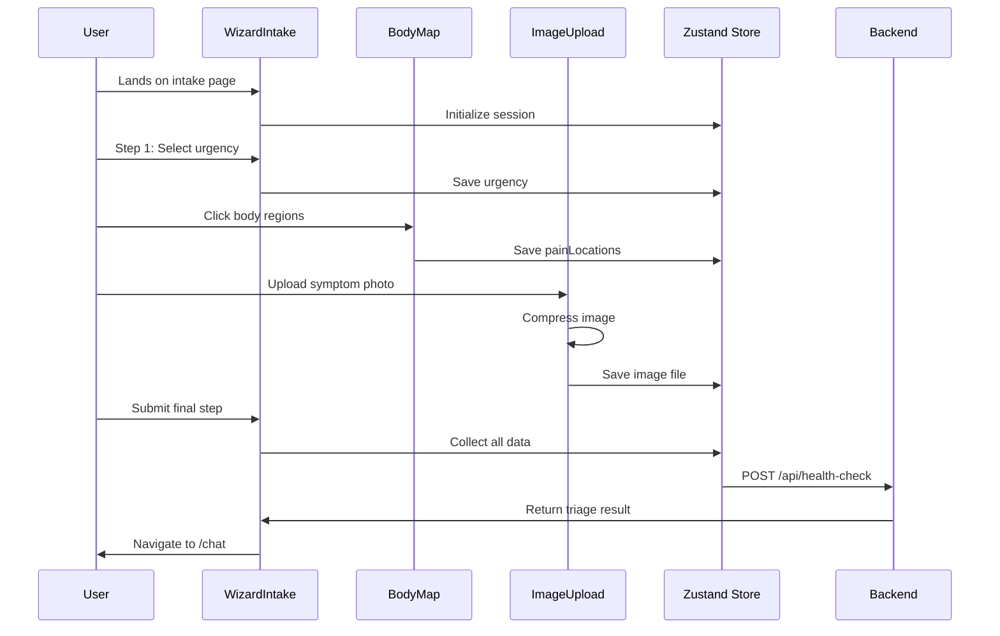

# Patient Intake System

**Purpose**: Guided multi-step patient data collection with visual symptom input

---

## Overview

The Patient Intake System transforms complex medical questionnaires into an intuitive, visual-first experience. Designed for users with varying levels of health literacy, it combines:

- **Multi-step wizard** for progressive disclosure
- **Interactive body map** for anatomical symptom location
- **Image upload** for visible conditions  
- **Smart validation** to ensure data completeness

---

## Core Components

### 1. WizardIntake (Main Orchestrator)

**File**: `frontend/components/organisms/WizardIntake.tsx`

**Purpose**: Multi-step form controller managing user journey through intake process

**Steps Flow**:

```
Step 1: Triage → Step 2: Chief Complaint → Step 3: Symptom Details → Submit
```

**Key Features**:
- **Progressive State Management**: Uses Zustand store to persist data across steps
- **Conditional Logic**: Shows/hides steps based on previous answers
- **Validation Gates**: Blocks progression until required fields complete
- **Session Integration**: Automatically creates/resumes sessions

**State Structure**:
```typescript
interface IntakeState {
  step: 1 | 2 | 3;
  triageData: {
    urgency: 'emergency' | 'urgent' | 'routine' | 'self_care';
    mainComplaint: string;
    duration: string;
    severity: 'mild' | 'moderate' | 'severe';
  };
  symptoms: {
    painLocations: BodyRegion[];
    painLevel: number; // 1-10 scale
    additionalSymptoms: string[];
  };
  images: File[];
}
```

---

### 2. BodyMapSelector (Visual Symptom Input)

**File**: `frontend/components/molecules/BodyMapSelector.tsx`

**Purpose**: Interactive anatomical diagram for precise symptom location

**Technology**: `@mjcdev/react-body-highlighter` library

**Features**:

#### Multi-Region Selection
```typescript
// User can select multiple body regions
<BodyMapSelector
  onSelect={(regions) => {
    // regions: ['chest', 'leftArm', 'neck']
    setSymptomLocations(regions);
  }}
  selectedRegions={symptomLocations}
  maxSelections={5}
/>
```

#### Visual Feedback
- **Hover**: Region highlights with tooltip name
- **Selected**: Fills with color (red for pain indication)  
- **Multiple**: Tracks array of selected regions

#### Mobile-Optimized
- Tap interaction on touch devices
- Zoom controls for precision
- Portrait/landscape responsive layout

**Why This Matters**:
- Eliminates need for medical terminology ("Where does it hurt?")
- Works for users with limited literacy
- More precise than text description
- Visual record for doctor handoff

---

### 3. ImageUpload Component

**File**: `frontend/components/molecules/ImageUpload.tsx`

**Purpose**: Capture/upload photos of visible conditions

**Features**:

#### Multi-Source Input
```typescript
<ImageUpload
  onUpload={(files) => handleImageUpload(files)}
  maxFiles={3}
  acceptedFormats={['image/jpeg', 'image/png', 'image/webp']}
  maxSizeThe MB={5}
/>
```

**Input Methods**:
1. **Camera Capture** (mobile): Direct camera access via `<input capture="environment">`
2. **File Upload** (desktop): Drag-and-drop or file picker
3. **Paste from Clipboard**: Ctrl+V for screenshots

#### Client-Side Processing
```typescript
// Before upload: resize + compress
const processImage = async (file: File) => {
  const canvas = document.createElement('canvas');
  // ... resize to max 1024px width
  // ... compress to 80% quality
  return compressedBlob;
};
```

**Optimization Strategy**:
- Target: < 500KB per image
- Preserves medical detail while reducing bandwidth
- Critical for 3G/4G networks in Vietnam

#### Preview Interface
- Thumbnail grid with remove option
- Full-size modal viewer
- Upload progress indicators

---

### 4. PatientIntakeForm

**File**: `frontend/components/organisms/PatientIntakeForm.tsx`

**Purpose**: Structured form fields with validation

**Form Architecture** (React Hook Form + Zod):

```typescript
const intakeSchema = z.object({
  // Step 1: Triage
  urgency: z.enum(['emergency', 'urgent', 'routine', 'self_care']),
  mainComplaint: z.string().min(10, 'Please describe in detail'),
  
  // Step 2: Symptoms
  duration: z.string(),
  painLevel: z.number().min(1).max(10),
  symptoms: z.array(z.string()),
  
  // Step 3: Additional Info
  age: z.number().optional(),
  gender: z.enum(['male', 'female', 'other', 'prefer_not_to_say']).optional(),
  existingConditions: z.array(z.string()).optional(),
});

type IntakeData = z.infer<typeof intakeSchema>;
```

**Dynamic Field Rendering**:
```typescript
// Show different fields based on urgency
{urgency === 'emergency' && (
  <FormField
    label="When did symptoms start?"
    type="datetime-local"
    required
  />
)}
```

---

## Data Flow Architecture

### Step-by-Step User Journey



---

## State Management (Zustand)

**Store**: `frontend/store/intakeStore.ts`

```typescript
interface IntakeStore {
  // State
  currentStep: number;
  intakeData: Partial<IntakeData>;
  images: File[];
  sessionId: string | null;
  
  // Actions
  setStep: (step: number) => void;
  updateIntakeData: (data: Partial<IntakeData>) => void;
  addImage: (file: File) => void;
  removeImage: (index: number) => void;
  submitIntake: () => Promise<void>;
  reset: () => void;
}

const useIntakeStore = create<IntakeStore>()(
  persist(
    (set, get) => ({
      // Implementation
      currentStep: 1,
      intakeData: {},
      images: [],
      
      submitIntake: async () => {
        const { intakeData, images, sessionId } = get();
        
        // Upload images first
        const imageUrls = await Promise.all(
          images.map(img => uploadImage(img))
        );
        
        // Send to backend
        const response = await fetch('/api/health-check', {
          method: 'POST',
          body: JSON.stringify({
            ...intakeData,
            image_urls: imageUrls,
            session_id: sessionId,
          }),
        });
        
        // Navigate to chat
        router.push('/chat');
      },
    }),
    { name: 'medagen-intake' } // Persists to localStorage
  )
);
```

---

## Form Validation Strategy

### Progressive Validation

**Principle**: Validate on blur, not on change (reduces friction)

```typescript
<FormField
  name="mainComplaint"
  validate={(value) => {
    if (value.length < 10) return 'Please provide more detail';
    if (value.length > 500) return 'Please keep under 500 characters';
    return true;
  }}
  onBlur={() => trigger('mainComplaint')} // Validate on blur
/>
```

### Visual Feedback

**Error States**:
```tsx
{errors.mainComplaint && (
  <span className="text-red-500 text-sm flex items-center gap-1">
    <AlertCircle size={16} />
    {errors.mainComplaint.message}
  </span>
)}
```

**Success States**:
```tsx
{touchedFields.mainComplaint && !errors.mainComplaint && (
  <CheckCircle className="text-green-500" size={20} />
)}
```

---

## Integration with Chat System

### Handoff Process

Once intake complete:

1. **Data Packaging**:
```typescript
const contextSummary = {
  urgency: intakeData.urgency,
  complaint: intakeData.mainComplaint,
  painLocations: intakeData.painLocations.map(loc => loc.label).join(', '),
  duration: intakeData.duration,
  painLevel: intakeData.painLevel,
  images: imageUrls,
};
```

2. **Session Creation**:
```typescript
POST /api/sessions/create
Body: {
  user_id: currentUser.id,
  initial_context: contextSummary,
}
Response: { session_id: "abc123" }
```

3. **Auto-Send First Message**:
```typescript
// In ChatWindow component
useEffect(() => {
  if (sessionContext.fromIntake) {
    const initialMessage = `I have ${contextSummary.complaint}. 
      Pain level: ${contextSummary.painLevel}/10.
      Location: ${contextSummary.painLocations}.
      Duration: ${contextSummary.duration}.`;
    
    sendMessage(initialMessage, contextSummary.images);
  }
}, []);
```

---

## Mobile Optimization

### Touch-First Design

**Body Map**:
- Tap targets ≥ 44px (Apple HIG)
- Visual feedback on touch
- Pinch-to-zoom support

**Form Inputs**:
```html
<!-- Optimized input types -->
<input type="number" inputmode="numeric" /> <!-- Numeric keyboard -->
<input type="tel" />                        <!-- Phone keyboard -->
<input type="email" />                      <!-- Email keyboard -->
```

### Progressive Enhancement

**Image Upload Fallback**:
```typescript
if ('mediaDevices' in navigator) {
  // Use camera API
  <input type="file" capture="environment" />
} else {
  // Fallback to file picker
  <input type="file" accept="image/*" />
}
```

---

## Accessibility Features

### Screen Reader Support

```tsx
<BodyMapSelector
  aria-label="Select areas of pain on body diagram"
  selectedRegions={regions}
  announceSelection={(region) => `Selected ${region.label}`}
/>
```

### Keyboard Navigation

```typescript
// Step navigation with keyboard
<button
  onClick={nextStep}
  onKeyDown={(e) => {
    if (e.key === 'Enter') nextStep();
  }}
  aria-label="Continue to next step"
>
  Next
</button>
```

### High Contrast Mode

```css
@media (prefers-contrast: high) {
  .body-map-region:hover {
    outline: 3px solid black;
  }
}
```

---

## Performance Optimizations

### Lazy Loading

```typescript
// Load body map component only when needed
const BodyMapSelector = dynamic(
  () => import('@/components/molecules/BodyMapSelector'),
  { ssr: false, loading: () => <Skeleton className="h-96" /> }
);
```

### Image Optimization

**Before Upload**:
1. Resize to max 1024×1024
2. Convert to WebP (if supported)
3. Compress to ~80% quality
4. Target: < 500KB per image

**During Upload**:
- Show progress bar
- Allow cancellation
- Retry on network failure

---

## Error Handling

### Network Issues

```typescript
const submitWithRetry = async (data, maxRetries = 3) => {
  for (let i = 0; i < maxRetries; i++) {
    try {
      return await submitIntake(data);
    } catch (error) {
      if (i === maxRetries - 1) throw error;
      await sleep(1000 * (i + 1)); // Exponential backoff
    }
  }
};
```

### Data Persistence

```typescript
// Auto-save draft every 30 seconds
useEffect(() => {
  const interval = setInterval(() => {
    localStorage.setItem('intake-draft', JSON.stringify(intakeData));
  }, 30000);
  
  return () => clearInterval(interval);
}, [intakeData]);

// Restore on page load
useEffect(() => {
  const draft = localStorage.getItem('intake-draft');
  if (draft) {
    setIntakeData(JSON.parse(draft));
  }
}, []);
```

---

## Testing Considerations

### Unit Tests

```typescript
describe('BodyMapSelector', () => {
  it('allows selecting multiple regions', () => {
    const { getByLabelText } = render(<BodyMapSelector />);
    fireEvent.click(getByLabelText('Chest'));
    fireEvent.click(getByLabelText('Left Arm'));
    expect(selectedRegions).toEqual(['chest', 'leftArm']);
  });
});
```

### Integration Tests

```typescript
describe('Intake Flow', () => {
  it('completes full intake and creates session', async () => {
    // Step 1: Select urgency
    await userEvent.click(screen.getByText('Urgent'));
    await userEvent.click(screen.getByText('Next'));
    
    // Step 2: Add complaint
    await userEvent.type(
      screen.getByLabelText('Main Complaint'),
      'Chest pain radiating to left arm'
    );
    
    // Step 3: Submit
    await userEvent.click(screen.getByText('Submit'));
    
    // Verify API call
    expect(mockFetch).toHaveBeenCalledWith('/api/health-check', {
      method: 'POST',
      body: expect.objectContaining({
        mainComplaint: expect.stringContaining('Chest pain'),
      }),
    });
  });
});
```

---

## Future Enhancements

- **Voice Input**: For users with low literacy or physical limitations
- **Multi-Language**: Vietnamese, English, Khmer, Thai
- **Offline Mode**: Save drafts and sync when online
- **Smart Suggestions**: Auto-complete common complaints based on body region
- **Symptom Checker Integration**: "Did you also experience X?" prompts
