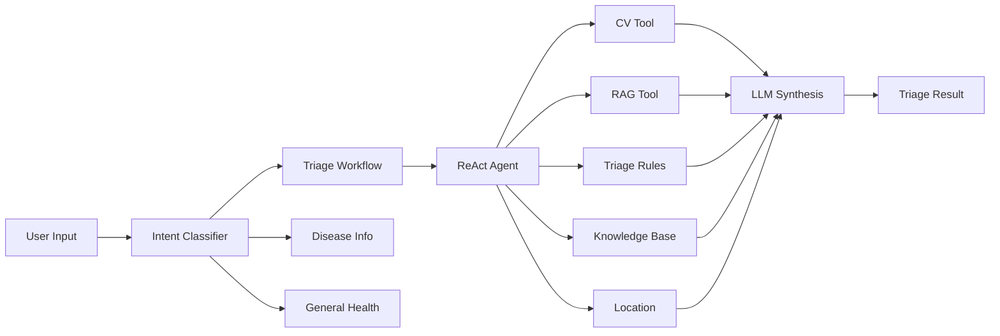

# AI Triage Engine

**Purpose**: Intelligent medical triage using ReAct Agent framework with transparent reasoning

---

## Overview

The AI Triage Engine is the brain of Medagen, powered by **Google Gemini 2.5 Flash** and **LangChain ReAct framework**. Unlike black-box AI systems, it shows its thinking process in real-time.

**Core Principle**: **Think → Act → Observe → Repeat → Answer**

---

## ReAct Framework Explained

### Traditional AI (Black Box)
```
User: "I have chest pain"
AI: ❓ [magic happens] ❓
→ "Go to ER immediately"
```

### ReAct Agent (Transparent)
```
User: "I have chest pain"

💭 Thought: Chest pain could be cardiac, musculoskeletal, or GI. 
           Need more context to assess urgency.

🔧 Action: search_knowledge_base("chest pain causes")

👁️ Observation: Found: cardiac (emergency), muscle strain (routine),
                GERD (routine), anxiety (routine)

💭 Thought: Need to check for red flags (radiation, shortness of breath,
           nausea, diaphoresis)

🔧 Action: evaluate_triage_rules(symptoms: ["chest pain"])

👁️ Observation: RED FLAG DETECTED - chest pain warrants emergency eval

✅ Final Answer: EMERGENCY level. Call 115 or go to ER immediately.
                Chest pain requires urgent medical evaluation.
```

**Why This Matters**: Users see the agent isn't guessing - it's reasoning through clinical logic.

---

## Architecture

### Core Components

**File**: `src/agent/agent-executor.ts`



---

## Intent Classification

**File**: `src/services/intent-classifier.service.ts`

**Purpose**: Route user input to appropriate workflow

### Intent Categories

| Intent | Description | Example | Workflow |
|--------|-------------|---------|----------|
| **triage** | Needs urgency assessment | "Chest pain for 2 hours" | Full ReAct triage |
| **disease_info** | Educational query | "What is diabetes?" | Knowledge base lookup |
| **symptom_inquiry** | Symptom clarification | "Is headache serious?" | RAG + educational |
| **general_health** | General wellness | "How to eat healthy?" | RAG search |
| **out_of_scope** | Non-medical | "Book appointment" | Polite rejection |

### Classification Logic

```typescript
export class IntentClassifierService {
  classifyIntent(text: string, hasImage: boolean): Intent {
    const normalized = text.toLowerCase();
    
    // Emergency keywords → triage
    const emergencyKeywords = [
      'chest pain', 'can\'t breathe', 'severe bleeding',
      'unconscious', 'seizure', 'stroke'
    ];
    if (emergencyKeywords.some(kw => normalized.includes(kw))) {
      return { type: 'triage', confidence: 'high', urgency: 'emergency' };
    }
    
    // Image present → likely triage
    if (hasImage) {
      return { type: 'triage', confidence: 'medium' };
    }
    
    // "What is X?" → disease_info
    if (/what is|define|tell me about/i.test(text)) {
      return { type: 'disease_info', confidence: 'high' };
    }
    
    // Default to triage if symptoms mentioned
    const symptomKeywords = ['pain', 'fever', 'rash', 'swelling', 'bleeding'];
    if (symptomKeywords.some(kw => normalized.includes(kw))) {
      return { type: 'triage', confidence: 'medium' };
    }
    
    return { type: 'general_health', confidence: 'low' };
  }
}
```

---

## Agent Initialization

**File**: `src/agent/agent-executor.ts`

### LLM Configuration

```typescript
import { ChatGoogleGenerativeAI } from '@langchain/google-genai';

const llm = new ChatGoogleGenerativeAI({
  model: 'gemini-2.5-flash-latest',
  temperature: 0.1, // Low temp for medical consistency
  maxOutputTokens: 2048,
  apiKey: process.env.GEMINI_API_KEY,
});
```

**Why Gemini 2.5 Flash**:
- ⚡ Fast inference (< 2s typical)
- 📚 128k context window (full conversation history)
- 💰 Cost-effective ($0.075 / 1M tokens)
- 🧠 Strong reasoning capabilities
- 🌍 Multi-language support (Vietnamese + English)

### Tool Registration

```typescript
const tools = [
  createToolCVDerm(),       // Dermatology image analysis
  createToolCVEye(),        // Ophthalmology analysis
  createToolCVWound(),      // Wound assessment
  createToolRAGSearch(),    // Guideline vector search
  createToolKnowledgeBase(),// Structured medical DB
  createToolTriageRules(),  // Clinical rule engine
  createToolMaps(),         // Location services
];

const agent = await initializeAgentExecutorWithOptions(tools, llm, {
  agentType: 'chat-conversational-react-description',
  verbose: true,
  maxIterations: 10,
  earlyStoppingMethod: 'generate',
});
```

---

## System Prompt Design

**File**: `src/agent/system-prompt.ts`

### Prompt Structure

```typescript
export const SYSTEM_PROMPT = `You are Medagen AI Triage Assistant.

ROLE:
- Assess symptom urgency (Emergency/Urgent/Routine/Self-care)
- Provide evidence-based guidance
- Show transparent reasoning process

CRITICAL SAFETY RULES:
1. NEVER diagnose diseases
2. NEVER prescribe medications
3. NEVER give definitive medical conclusions
4. ALWAYS recommend professional eval for serious symptoms
5. ALWAYS identify red flags

RED FLAGS (require Emergency level):
- Chest pain with radiation/SOB/diaphoresis
- Severe head injury or altered consciousness
- Difficulty breathing / choking
- Severe bleeding that won't stop
- Signs of stroke (FAST: Face/Arm/Speech/Time)
- Severe allergic reaction (anaphylaxis)

TOOLS AVAILABLE:
1. tool_cv_derm: Analyze skin conditions from images
2. tool_cv_eye: Analyze eye conditions from images
3. tool_cv_wound: Analyze wounds from images
4. tool_rag_search: Search medical guidelines (Bộ Y Tế, WHO)
5. tool_knowledge_base: Query structured disease database
6. tool_triage_rules: Apply clinical decision rules
7. tool_maps: Find nearby medical facilities

WORKFLOW:
1. Analyze user input (text + optional image)
2. Classify intent
3. Use appropriate tools to gather evidence
4. Apply triage rules
5. Synthesize comprehensive response

OUTPUT FORMAT:
Always return structured JSON:
{
  "triage_level": "emergency|urgent|routine|self_care",
  "symptom_summary": "concise summary",
  "red_flags": ["flag1", "flag2"], // if any
  "suspected_conditions": [
    {"name": "condition", "confidence": "high|medium|low", "source": "cv_model|guideline|reasoning"}
  ],
  "recommendation": {
    "action": "specific action to take",
    "timeframe": "when to seek care",
    "home_care_advice": "self-care if appropriate",
    "warning_signs": "when to escalate"
  }
}

LANGUAGE:
- Respond in user's language (Vietnamese or English)
- Use simple, non-technical terms
- Explain medical terms when necessary

Remember: You are a triage tool, not a doctor. Your goal is safe, transparent guidance.`;
```

---

## Tool Implementations

### 1. Computer Vision Tools

**File**: `src/mcp_tools/cv-tool.ts`

```typescript
export function createToolCVDerm() {
  return new DynamicStructuredTool({
    name: 'tool_cv_derm',
    description: 'Analyze dermatological conditions from skin images. Returns top condition probabilities.',
    schema: z.object({
      image_url: z.string().url().describe('URL of skin condition image'),
    }),
    func: async ({ image_url }) => {
      const result = await cvService.callDermCV(image_url);
      
      // Format for agent
      return JSON.stringify({
        model: 'derm_cv',
        top_conditions: result.top_conditions.map(c => ({
          name: c.name,
          probability: c.prob,
          confidence: c.prob > 0.7 ? 'high' : c.prob > 0.4 ? 'medium' : 'low',
        })),
      });
    },
  });
}
```

**Agent Usage Example**:
```
🔧 Action: tool_cv_derm
   Input: {"image_url": "https://..."}

👁️ Observation: {
     "model": "derm_cv",
     "top_conditions": [
       {"name": "Acne Vulgaris", "probability": 0.78, "confidence": "high"},
       {"name": "Rosacea", "probability": 0.15, "confidence": "low"}
     ]
   }
```

### 2. RAG Search Tool

**File**: `src/mcp_tools/rag-tool.ts`

```typescript
export function createToolRAGSearch() {
  return new DynamicStructuredTool({
    name: 'tool_rag_search',
    description: 'Search medical guidelines (Bộ Y Tế, WHO) using semantic search. Use for clinical protocols, treatment guidelines, or when CV results need validation.',
    schema: z.object({
      query: z.string().describe('Search query (symptoms, condition name, or clinical question)'),
      top_k: z.number().default(5).describe('Number of results to return'),
    }),
    func: async ({ query, top_k }) => {
      const results = await ragService.searchGuidelines(query, top_k);
      
      return JSON.stringify({
        query,
        guidelines: results.map(r => ({
          content: r.content,
          source: r.metadata.source,
          relevance_score: r.similarity,
        })),
      });
    },
  });
}
```

**Agent Usage Example**:
```
🔧 Action: tool_rag_search
   Input: {"query": "chest pain emergency criteria", "top_k": 3}

👁️ Observation: {
     "guidelines": [
       {
         "content": "Chest pain with radiation to arm/jaw, SOB, diaphoresis → Emergency",
         "source": "Bộ Y Tế Emergency Triage Protocol 2023",
         "relevance_score": 0.92
       },
       ...
     ]
   }
```

### 3. Triage Rules Tool

**File**: `src/mcp_tools/triage-rules-tool.ts`

```typescript
export function createToolTriageRules() {
  return new DynamicStructuredTool({
    name: 'tool_triage_rules',
    description: 'Apply clinical decision rules to determine triage level. Use after gathering symptom information.',
    schema: z.object({
      symptoms: z.object({
        main_complaint: z.string(),
        red_flags: z.array(z.string()).optional(),
        pain_severity: z.enum(['mild', 'moderate', 'severe']).optional(),
        duration: z.string().optional(),
      }),
    }),
    func: async ({ symptoms }) => {
      const result = await triageRulesService.evaluateSymptoms(symptoms);
      
      return JSON.stringify({
        triage_level: result.triage,
        red_flags_detected: result.red_flags,
        reasoning: result.reasoning,
      });
    },
  });
}
```

---

## Execution Flow

### Example: Chest Pain Emergency

**User Input**: "I have chest pain radiating to my left arm, I'm sweating and short of breath"

### Agent Execution Trace

```typescript
// Iteration 1
💭 Thought: Multiple red flags present (chest pain, radiation, SOB, diaphoresis).
           This is likely a cardiac emergency. Need to confirm with triage rules.

🔧 Action: tool_triage_rules
   Input: {
     "symptoms": {
       "main_complaint": "chest pain",
       "red_flags": ["radiation to arm", "shortness of breath", "diaphoresis"],
       "pain_severity": "severe"
     }
   }

👁️ Observation: {
     "triage_level": "emergency",
     "red_flags_detected": ["chest pain with radiation", "shortness of breath"],
     "reasoning": "Combination of symptoms suggests possible acute coronary syndrome"
   }

// Iteration 2
💭 Thought: Triage rules confirm emergency. Should search guidelines for 
           specific emergency protocols.

🔧 Action: tool_rag_search
   Input: {"query": "acute chest pain emergency protocol"}

👁️ Observation: {
     "guidelines": [{
       "content": "Call 115 immediately. Do not drive yourself. Chew aspirin if not allergic...",
       "source": "Vietnam Emergency Medicine Guidelines 2023"
     }]
   }

// Iteration 3
💭 Thought: Have enough information. Emergency confirmed, have protocol guidance.
           Should provide immediate actionable advice and facility info.

🔧 Action: [considers tool_maps but decides unnecessary for true emergency]

✅ Final Answer: {
     "triage_level": "emergency",
     "symptom_summary": "Chest pain radiating to left arm with shortness of breath and sweating",
     "red_flags": [
       "Chest pain with radiation to arm",
       "Shortness of breath",
       "Diaphoresis (sweating)"
     ],
     "suspected_conditions": [
       {
         "name": "Possible Acute Coronary Syndrome",
         "confidence": "high",
         "source": "reasoning"
       }
     ],
     "recommendation": {
       "action": "🚨 CALL 115 IMMEDIATELY. Do NOT drive yourself. This is a medical emergency.",
       "timeframe": "NOW - every minute matters",
       "home_care_advice": "While waiting: Sit down, loosen tight clothing, chew 1 aspirin (if not allergic)",
       "warning_signs": "If pain worsens or you lose consciousness, ensure someone is with you"
     }
   }
```

---

## Conversation Memory

**File**: `src/services/conversation-history.service.ts`

### Session-Based Context

```typescript
export class ConversationHistoryService {
  async getContextString(sessionId: string, limit: number = 10): Promise<string> {
    const history = await this.getHistory(sessionId, limit);
    
    // Format for agent context
    return history.messages.map(msg => {
      const role = msg.role === 'user' ? 'Human' : 'AI';
      let content = msg.content;
      
      // Include triage results from previous turns
      if (msg.role === 'assistant' && msg.triage_result) {
        content += `\n[Previous assessment: ${msg.triage_result.triage_level}]`;
      }
      
      return `${role}: ${content}`;
    }).join('\n\n');
  }
}
```

### Multi-Turn Example

```
Turn 1:
Human: "I have a headache"
AI: [assesses → ROUTINE] "Mild headache. Rest, hydrate, OTC pain reliever."

Turn 2:
Human: "Now I have a stiff neck and fever"
AI: [recalls previous headache + NEW symptoms]
    💭 Thought: Headache + stiff neck + fever = meningitis red flags!
    🔧 Action: tool_triage_rules
    👁️ Observation: EMERGENCY - meningitis suspected
    ✅ Final Answer: Escalated to EMERGENCY. Seek immediate care.
```

**Why This Matters**: Symptoms evolve. The agent must track changes and re-assess dynamically.

---

## Safety Guardrails

### Hard-Coded Rules

```typescript
// Never override these safety rules
const SAFETY_GUARDRAILS = {
  // Always emergency regardless of LLM output
  forceEmergency: [
    /chest pain.*arm|jaw|back/i,
    /can't breathe|choking/i,
    /severe bleeding/i,
    /unconscious|unresponsive/i,
    /stroke|FAST/i,
  ],
  
  // Never provide these
  prohibited: [
    /prescribe|medication dosage/i,
    /diagnose with certainty/i,
    /instead of seeing doctor/i,
  ],
};

// Post-process LLM output
function applySafetyGuardrails(llmOutput: TriageResult): TriageResult {
  const text = JSON.stringify(llmOutput);
  
  // Check for emergency override
  for (const pattern of SAFETY_GUARDRAILS.forceEmergency) {
    if (pattern.test(text)) {
      llmOutput.triage_level = 'emergency';
      llmOutput.red_flags.push('Critical symptom pattern detected');
    }
  }
  
  // Check for prohibited content
  for (const pattern of SAFETY_GUARDRAILS.prohibited) {
    if (pattern.test(text)) {
      throw new Error('AI generated prohibited medical advice');
    }
  }
  
  return llmOutput;
}
```

---

## WebSocket Streaming

**File**: `src/agent/websocket-callback.handler.ts`

**Purpose**: Stream agent thinking process to frontend in real-time

```typescript
export class WebSocketCallbackHandler extends BaseCallbackHandler {
  constructor(private ws: WebSocket, private sessionId: string) {
    super();
  }
  
  // Stream thoughts
  async handleAgentAction(action: AgentAction) {
    this.ws.send(JSON.stringify({
      type: 'thought',
      content: action.log,
      timestamp: new Date().toISOString(),
    }));
    
    this.ws.send(JSON.stringify({
      type: 'action_start',
      tool_name: action.tool,
      input: action.toolInput,
      timestamp: new Date().toISOString(),
    }));
  }
  
  // Stream observations
  async handleToolEnd(output: string) {
    this.ws.send(JSON.stringify({
      type: 'observation',
      content: output,
      timestamp: new Date().toISOString(),
    }));
  }
  
  // Stream final answer
  async handleAgentEnd(output: AgentFinish) {
    this.ws.send(JSON.stringify({
      type: 'final_answer',
      content: output.returnValues.output,
      timestamp: new Date().toISOString(),
    }));
  }
}
```

**Frontend receives**:
```json
{ "type": "thought", "content": "Need to check for red flags..." }
{ "type": "action_start", "tool_name": "tool_triage_rules", "input": {...} }
{ "type": "observation", "content": "Emergency level detected" }
{ "type": "final_answer", "content": "Call 115 immediately" }
```

---

## Performance Optimization

### Parallel Tool Execution

```typescript
// When tools don't depend on each other, run in parallel
const [cvResult, ragResult] = await Promise.all([
  cvService.callDermCV(imageUrl),
  ragService.searchGuidelines(query),
]);
```

### Caching Strategy

```typescript
// Cache guideline embeddings
const cache = new NodeCache({ stdTTL: 3600 }); // 1 hour

async function searchWithCache(query: string) {
  const cacheKey = `rag:${query}`;
  const cached = cache.get(cacheKey);
  if (cached) return cached;
  
  const result = await ragService.search(query);
  cache.set(cacheKey, result);
  return result;
}
```

---

## Error Handling

### Graceful Degradation

```typescript
async function resilientToolCall(toolFunc: Function) {
  try {
    return await toolFunc();
  } catch (error) {
    logger.error('Tool call failed', error);
    
    // Fallback strategy
    return {
      success: false,
      error: 'Service temporarily unavailable',
      fallback_advice: 'If symptoms are severe, seek immediate medical care',
    };
  }
}
```

### Agent Recovery

```typescript
// If agent gets stuck (max iterations reached)
if (agentIterations >= MAX_ITERATIONS) {
  return {
    triage_level: 'urgent',
    symptom_summary: conversationHistory,
    recommendation: {
      action: 'Unable to complete automated assessment. Please consult a healthcare professional.',
      timeframe: 'As soon as possible',
    },
  };
}
```

---

## Testing

### Unit Test Example

```typescript
describe('Intent Classifier', () => {
  it('classifies emergency keywords as triage intent', () => {
    const intent = classifier.classifyIntent('chest pain');
    expect(intent.type).toBe('triage');
    expect(intent.urgency).toBe('emergency');
  });
});
```

### Integration Test Example

```typescript
describe('Agent Execution', () => {
  it('escalates to emergency for chest pain symptoms', async () => {
    const result = await agent.processTriage(
      'Severe chest pain radiating to arm',
      null,
      'test-user'
    );
    
    expect(result.triage_level).toBe('emergency');
    expect(result.red_flags).toContain('Chest pain with radiation');
  });
});
```

---

## Future Enhancements

- **Multi-Agent Collaboration**: Specialist agents for different domains
- **Reinforcement Learning**: Learn from doctor feedback on triage accuracy
- **Explainability Dashboard**: Visualize agent decision tree
- **A/B Testing**: Compare prompt variations for accuracy
- **Offline Mode**: Cached guidelines + local LLM for zero-connectivity scenarios
