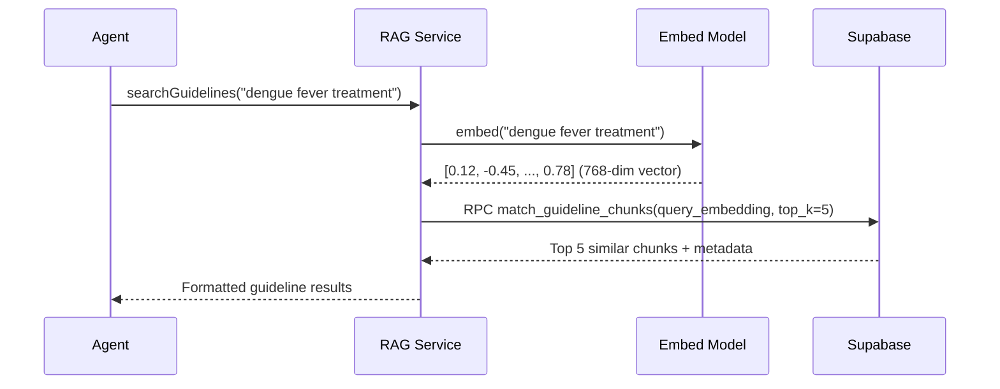

# RAG Knowledge System

**Purpose**: Retrieval-Augmented Generation for medical guideline search and knowledge base queries

---

## Overview

RAG (Retrieval-Augmented Generation) enhances the AI agent with external medical knowledge:

**Without RAG**: LLM relies only on training data (outdated, generic)
**With RAG**: LLM queries current guidelines + structured medical knowledge

```
User: "How to treat dengue fever?"
→ RAG searches Vietnam Ministry of Health dengue protocols
→ LLM synthesizes answer from current guidelines
→ Response includes latest treatment recommendations
```

---

## Two Knowledge Sources

### 1. Vector Search (Guideline Chunks)

**Purpose**: Semantic search through unstructured medical documents

**Data Sources**:
- Bộ Y Tế (Vietnam Ministry of Health) guidelines
- WHO clinical protocols
- CDC disease information
- Medical textbook chapters

**Storage**: Supabase `pgvector` extension

**Table Schema**:
```sql
CREATE TABLE guideline_chunks (
  id UUID PRIMARY KEY,
  content TEXT,                    -- Guideline text
  embedding VECTOR(768),            -- Text embedding
  metadata JSONB,                   -- {source, category, date, language}
  created_at TIMESTAMP
);

-- Vector similarity index
CREATE INDEX ON guideline_chunks 
  USING ivfflat (embedding vector_cosine_ops);
```

### 2. Structured Knowledge Base

**Purpose**: Precise queries for disease/symptom information

**Tables**:
```sql
CREATE TABLE diseases (
  id UUID PRIMARY KEY,
  name_en TEXT,
  name_vi TEXT,
  category TEXT,              -- e.g., "Infectious", "Dermatological"
  symptoms JSONB,             -- Array of symptom objects
  risk_factors JSONB,
  treatments JSONB,
  prevention JSONB,
  emergency_signs JSONB,
  embedding VECTOR(768)
);

CREATE TABLE symptoms (
  id UUID PRIMARY KEY,
  name TEXT,
  severity_indicator TEXT,    -- "mild", "moderate", "severe", "emergency"
  associated_diseases JSONB,  -- Links to disease IDs
  red_flag BOOLEAN
);
```

---

## RAG Service Implementation

**File**: `src/services/rag.service.ts`

### Initialization

```typescript
export class RAGService {
  private supabase: SupabaseClient;
  private embedModel: GoogleGenerativeAIEmbeddings;
  
  async initialize() {
    this.supabase = createClient(
      process.env.SUPABASE_URL!,
      process.env.SUPABASE_SERVICE_KEY!
    );
    
    this.embedModel = new GoogleGenerativeAIEmbeddings({
      model: 'text-embedding-004',
      apiKey: process.env.GEMINI_API_KEY,
    });
  }
}
```

### Search Workflow



### Search Method

```typescript
async searchGuidelines(
  query: string,
  topK: number = 5
): Promise<GuidelineResult[]> {
  try {
    // Step 1: Generate query embedding
    const queryEmbedding = await this.embedModel.embedQuery(query);
    
    // Step 2: Call Supabase RPC function for vector search
    const { data, error } = await this.supabase.rpc(
      'match_guideline_chunks',
      {
        query_embedding: queryEmbedding,
        match_count: topK,
        match_threshold: 0.7, // Minimum similarity score
      }
    );
    
    if (error) throw error;
    
    // Step 3: Format results
    return data.map((chunk: any) => ({
      content: chunk.content,
      similarity: chunk.similarity,
      metadata: {
        source: chunk.metadata.source,
        category: chunk.metadata.category,
        date: chunk.metadata.date,
        language: chunk.metadata.language || 'vi',
      },
    }));
  } catch (error) {
    logger.error('RAG search failed:', error);
    return [];
  }
}
```

### Supabase RPC Function

```sql
-- File: migration.sql
CREATE OR REPLACE FUNCTION match_guideline_chunks(
  query_embedding VECTOR(768),
  match_count INT DEFAULT 5,
  match_threshold FLOAT DEFAULT 0.7
)
RETURNS TABLE (
  id UUID,
  content TEXT,
  metadata JSONB,
  similarity FLOAT
)
LANGUAGE plpgsql
AS $$
BEGIN
  RETURN QUERY
  SELECT
    guideline_chunks.id,
    guideline_chunks.content,
    guideline_chunks.metadata,
    1 - (guideline_chunks.embedding <=> query_embedding) AS similarity
  FROM guideline_chunks
  WHERE 1 - (guideline_chunks.embedding <=> query_embedding) > match_threshold
  ORDER BY guideline_chunks.embedding <=> query_embedding
  LIMIT match_count;
END;
$$;
```

**Operator**: `<=>` is cosine distance (pgvector)
**Similarity Conversion**: `1 - distance = similarity` (0-1 scale)

---

## Knowledge Base Service

**File**: `src/services/knowledge-base.service.ts`

### Disease Lookup

```typescript
export class KnowledgeBaseService {
  async findDisease(diseaseName: string): Promise<DiseaseInfo | null> {
    const { data, error } = await this.supabase
      .from('diseases')
      .select('*')
      .or(`name_en.ilike.%${diseaseName}%,name_vi.ilike.%${diseaseName}%`)
      .limit(1)
      .single();
    
    if (error || !data) return null;
    
    return {
      id: data.id,
      name: data.name_en,
      nameVi: data.name_vi,
      category: data.category,
      symptoms: data.symptoms,
      treatments: data.treatments,
      emergencySigns: data.emergency_signs,
    };
  }
  
  async fuzzySearchDiseases(query: string, limit: number = 5) {
    // Use vector embedding for semantic search
    const queryEmbedding = await this.embedModel.embedQuery(query);
    
    const { data } = await this.supabase.rpc('match_diseases', {
      query_embedding: queryEmbedding,
      match_count: limit,
    });
    
    return data;
  }
}
```

---

## Integration with Agent

### Tool: RAG Search

**File**: `src/mcp_tools/rag-tool.ts`

```typescript
export function createToolRAGSearch() {
  return new DynamicStructuredTool({
    name: 'tool_rag_search',
    description: `Search medical guidelines from Vietnam Ministry of Health (Bộ Y Tế) and WHO. 
                  Use when: (1) Need clinical protocols, (2) CV results need validation, 
                  (3) User asks about disease treatment/prevention.`,
    schema: z.object({
      query: z.string().describe('Search query in English or Vietnamese'),
      top_k: z.number().default(5).optional(),
    }),
    func: async ({ query, top_k }) => {
      const results = await ragService.searchGuidelines(query, top_k);
      
      if (results.length === 0) {
        return JSON.stringify({
          status: 'no_results',
          message: 'No relevant guidelines found',
        });
      }
      
      return JSON.stringify({
        query,
        results: results.map(r => ({
          content: r.content,
          source: r.metadata.source,
          similarity: r.similarity.toFixed(2),
        })),
      });
    },
  });
}
```

### Agent Usage Example

```
User: "How to manage dengue fever at home?"

💭 Thought: User asking about disease management. Need to search 
           medical guidelines for dengue treatment protocols.

🔧 Action: tool_rag_search
   Input: {
     "query": "dengue fever home care management",
     "top_k": 3
   }

👁️ Observation: {
     "results": [
       {
         "content": "Dengue home care: Rest, adequate hydration (ORS), 
                     paracetamol for fever (NO aspirin/ibuprofen), 
                     monitor for warning signs (bleeding, abdominal pain)...",
         "source": "Bộ Y Tế - Dengue Clinical Guidelines 2023",
         "similarity": "0.89"
       },
       ...
     ]
   }

✅ Final Answer: Based on Vietnam Ministry of Health guidelines:
                 - Rest and adequate hydration (ORS recommended)
                 - Paracetamol for fever (avoid NSAIDs)
                 - Monitor for warning signs: severe abdominal pain, bleeding
                 - If warning signs → seek immediate medical care
```

---

## Embedding Strategy

### Model Choice

**Gemini `text-embedding-004`**:
- **Dimensions**: 768
- **Languages**: Multilingual (Vietnamese + English supported)
- **Performance**: Strong semantic understanding
- **Cost**: Free tier available

### Chunking Strategy

**Challenge**: Medical documents are long (10-50 pages)
**Solution**: Split into semantically meaningful chunks

```typescript
function chunkDocument(document: string): string[] {
  const maxChunkSize = 500; // ~500 tokens
  const chunks: string[] = [];
  
  // Split by section headers
  const sections = document.split(/\n##\s+/);
  
  for (const section of sections) {
    if (section.length <= maxChunkSize) {
      chunks.push(section);
    } else {
      // Further split long sections by paragraphs
      const paragraphs = section.split('\n\n');
      let currentChunk = '';
      
      for (const para of paragraphs) {
        if ((currentChunk + para).length > maxChunkSize) {
          chunks.push(currentChunk.trim());
          currentChunk = para;
        } else {
          currentChunk += '\n\n' + para;
        }
      }
      
      if (currentChunk) chunks.push(currentChunk.trim());
    }
  }
  
  return chunks;
}
```

**Metadata Preservation**:
```typescript
interface ChunkMetadata {
  source: string;           // "Bộ Y Tế Dengue Guidelines 2023"
  category: string;         // "Infectious Diseases"
  section: string;          // "Treatment Protocols"
  page: number;             // 15
  language: 'vi' | 'en';
  date: string;             // "2023-06-01"
}
```

---

## Data Pipeline

### 1. Guideline Ingestion

**File**: `src/scripts/seed-guidelines.ts`

```typescript
async function ingestGuidelines() {
  // Step 1: Load PDF/text documents
  const documents = await loadDocuments('./data/guidelines/');
  
  for (const doc of documents) {
    // Step 2: Extract text
    const text = await extractText(doc.path);
    
    // Step 3: Chunk document
    const chunks = chunkDocument(text);
    
    // Step 4: Generate embeddings batch
    const embeddings = await embedModel.embedDocuments(chunks);
    
    // Step 5: Insert into Supabase
    const records = chunks.map((chunk, i) => ({
      content: chunk,
      embedding: embeddings[i],
      metadata: {
        source: doc.name,
        category: doc.category,
        language: doc.language,
        date: doc.publishDate,
      },
    }));
    
    await supabase.from('guideline_chunks').insert(records);
  }
  
  console.log(`Ingested ${documents.length} documents`);
}
```

### 2. Disease Database Population

```typescript
async function seedDiseases() {
  const diseases = [
    {
      name_en: 'Dengue Fever',
      name_vi: 'Sốt xuất huyết',
      category: 'Infectious',
      symptoms: ['fever', 'headache', 'muscle_pain', 'rash', 'bleeding'],
      emergency_signs: ['severe_abdominal_pain', 'persistent_vomiting', 'bleeding'],
      treatments: ['supportive_care', 'hydration', 'fever_management'],
    },
    // ... more diseases
  ];
  
  for (const disease of diseases) {
    const embedding = await embedModel.embedQuery(
      `${disease.name_en} ${disease.name_vi} ${disease.symptoms.join(' ')}`
    );
    
    await supabase.from('diseases').insert({
      ...disease,
      embedding,
    });
  }
}
```

---

## Query Optimization

### 1. Hybrid Search

Combine vector + keyword search for best results:

```typescript
async function hybridSearch(query: string, topK: number = 5) {
  // Vector search (semantic)
  const vectorResults = await vectorSearch(query, topK * 2);
  
  // Keyword search (exact match)
  const keywordResults = await keywordSearch(query, topK * 2);
  
  // Combine and re-rank
  const combined = rerank([...vectorResults, ...keywordResults], query);
  
  return combined.slice(0, topK);
}

function rerank(results: any[], query: string): any[] {
  return results.sort((a, b) => {
    // Boost exact keyword matches
    const aExact = a.content.toLowerCase().includes(query.toLowerCase());
    const bExact = b.content.toLowerCase().includes(query.toLowerCase());
    
    if (aExact && !bExact) return -1;
    if (!aExact && bExact) return 1;
    
    // Otherwise sort by vector similarity
    return b.similarity - a.similarity;
  });
}
```

### 2. Query Expansion

Expand user queries with medical synonyms:

```typescript
function expandQuery(query: string): string[] {
  const expansions = {
    'headache': ['headache', 'cephalgia', 'head pain'],
    'rash': ['rash', 'skin eruption', 'exanthem'],
    'fever': ['fever', 'pyrexia', 'high temperature'],
  };
  
  const terms = query.toLowerCase().split(' ');
  const expanded = new Set([query]);
  
  for (const term of terms) {
    if (expansions[term]) {
      for (const synonym of expansions[term]) {
        expanded.add(query.replace(term, synonym));
      }
    }
  }
  
  return Array.from(expanded);
}
```

---

## Multilingual Support

### Vietnamese-English Dual Index

```typescript
// Index both languages for same content
async function indexBilingualGuideline(contentEn: string, contentVi: string) {
  const embeddingEn = await embedModel.embedQuery(contentEn);
  const embeddingVi = await embedModel.embedQuery(contentVi);
  
  await supabase.from('guideline_chunks').insert([
    {
      content: contentEn,
      embedding: embeddingEn,
      metadata: { language: 'en', source: '...' },
    },
    {
      content: contentVi,
      embedding: embeddingVi,
      metadata: { language: 'vi', source: '...' },
    },
  ]);
}
```

### Auto-Detect Query Language

```typescript
function detectLanguage(text: string): 'vi' | 'en' {
  // Simple heuristic: Vietnamese has diacritics
  const vietnameseChars = /[àáạảãâầấậẩẫăằắặẳẵèéẹẻẽêềếệểễìíịỉĩòóọỏõôồốộổỗơờớợởỡùúụủũưừứựửữỳýỵỷỹđ]/i;
  return vietnameseChars.test(text) ? 'vi' : 'en';
}

async function languageAwareSearch(query: string) {
  const language = detectLanguage(query);
  
  // Optionally filter by language
  const results = await this.supabase.rpc('match_guideline_chunks', {
    query_embedding: await this.embedModel.embedQuery(query),
    language_filter: language, // NEW parameter
  });
  
  return results;
}
```

---

## Performance

### Caching

```typescript
import NodeCache from 'node-cache';

const cache = new NodeCache({ stdTTL: 3600 }); // 1 hour

async function cachedSearch(query: string) {
  const cacheKey = `rag:${query}`;
  const cached = cache.get(cacheKey);
  
  if (cached) {
    logger.info('RAG cache hit');
    return cached;
  }
  
  const results = await ragService.searchGuidelines(query);
  cache.set(cacheKey, results);
  
  return results;
}
```

### Vector Index Optimization

```sql
-- IVFFlat index for approximate nearest neighbor (faster on large datasets)
CREATE INDEX guideline_chunks_embedding_idx 
  ON guideline_chunks 
  USING ivfflat (embedding vector_cosine_ops)
  WITH (lists = 100); -- number of clusters

-- For smaller datasets (<100k rows), use HNSW (more accurate)
CREATE INDEX guideline_chunks_embedding_idx 
  ON guideline_chunks 
  USING hnsw (embedding vector_cosine_ops);
```

---

## Quality Assurance

### Relevance Threshold

```typescript
const MINIMUM_SIMILARITY = 0.7; // Only return results >70% similar

async function searchWithThreshold(query: string) {
  const allResults = await ragService.searchGuidelines(query, 10);
  
  // Filter low-quality matches
  const relevant = allResults.filter(r => r.similarity >= MINIMUM_SIMILARITY);
  
  if (relevant.length === 0) {
    logger.warn(`No relevant results for query: ${query}`);
    return {
      status: 'low_confidence',
      message: 'Could not find highly relevant guidelines',
    };
  }
  
  return relevant;
}
```

### Source Attribution

Always cite sources in responses:

```typescript
// In agent response
{
  "recommendation": {
    "action": "For dengue fever: rest, hydration, monitor for bleeding",
    "source": "Vietnam Ministry of Health Dengue Guidelines 2023",
    "confidence": "high"
  }
}
```

---

## Testing

```typescript
describe('RAG Service', () => {
  it('retrieves relevant guidelines for dengue query', async () => {
    const results = await ragService.searchGuidelines('dengue fever treatment');
    
    expect(results.length).toBeGreaterThan(0);
    expect(results[0].similarity).toBeGreaterThan(0.75);
    expect(results[0].content).toContain('dengue');
    expect(results[0].metadata.source).toBeDefined();
  });
  
  it('handles Vietnamese queries', async () => {
    const results = await ragService.searchGuidelines('sốt xuất huyết điều trị');
    
    expect(results.length).toBeGreaterThan(0);
    expect(results[0].metadata.language).toBe('vi');
  });
});
```

---

## Future Enhancements

- **Real-time guideline updates**: Webhook to auto-ingest new published guidelines  
- **Federated search**: Query multiple external medical databases (PubMed, UpToDate)
- **Citation tracking**: Link back to specific page numbers in source documents
- **Version control**: Track guideline updates over time, show "Last updated: X days ago"
