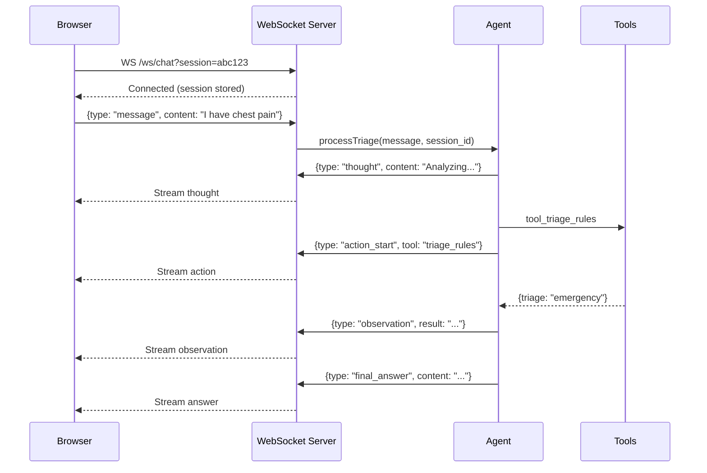

# Real-Time Chat & WebSocket

**Purpose**: Real-time communication with transparent AI reasoning via WebSocket streaming

---

## Overview

Traditional request-response APIs feel slow for conversational AI. WebSocket streaming provides:

✅ **Real-time updates**: See AI think in real-time  
✅ **Transparent reasoning**: Watch ReAct flow (Thought → Action → Observation)  
✅ **Better UX**: Feels conversational, not robotic  
✅ **Session continuity**: Persistent connection preserves context

---

## Architecture

### Connection Flow



---

## Backend Implementation

### WebSocket Server Setup

**File**: `src/index.ts` (Fastify)

```typescript
import fastify from 'fastify';
import websocket from '@fastify/websocket';

const server = fastify({ logger: true });

// Register WebSocket plugin
await server.register(websocket);

// WebSocket route
server.register(async (fastify) => {
  fastify.get('/ws/chat', { websocket: true }, async (connection, req) => {
    const sessionId = req.query.session as string;
    
    if (!sessionId) {
      connection.socket.close(1008, 'Missing session ID');
      return;
    }
    
    // Register connection
    wsManager.addConnection(sessionId, connection.socket);
    
    // Send connected confirmation
    connection.socket.send(JSON.stringify({
      type: 'connected',
      message: 'WebSocket connected successfully',
      session_id: sessionId,
      timestamp: new Date().toISOString(),
    }));
    
    // Handle messages
    connection.socket.on('message', async (rawMessage) => {
      try {
        const message = JSON.parse(rawMessage.toString());
        await handleMessage(message, sessionId, connection.socket);
      } catch (error) {
        connection.socket.send(JSON.stringify({
          type: 'error',
          message: 'Invalid message format',
        }));
      }
    });
    
    // Handle disconnection
    connection.socket.on('close', () => {
      wsManager.removeConnection(sessionId);
    });
  });
});
```

### Connection Manager

**File**: `src/services/websocket.service.ts`

```typescript
export class WebSocketConnectionManager {
  private connections: Map<string, WebSocket> = new Map();
  private lastActivity: Map<string, number> = new Map();
  
  addConnection(sessionId: string, ws: WebSocket) {
    this.connections.set(sessionId, ws);
    this.lastActivity.set(sessionId, Date.now());
    logger.info(`WebSocket connected: ${sessionId}`);
  }
  
  removeConnection(sessionId: string) {
    this.connections.delete(sessionId);
    this.lastActivity.delete(sessionId);
    logger.info(`WebSocket disconnected: ${sessionId}`);
  }
  
  sendToSession(sessionId: string, message: any) {
    const ws = this.connections.get(sessionId);
    if (ws && ws.readyState === WebSocket.OPEN) {
      ws.send(JSON.stringify(message));
      this.lastActivity.set(sessionId, Date.now());
      return true;
    }
    return false;
  }
  
  sendError(sessionId: string, errorType: string, message: string) {
    this.sendToSession(sessionId, {
      type: 'error',
      error_type: errorType,
      message,
      timestamp: new Date().toISOString(),
    });
  }
  
  // Cleanup inactive connections (>30 min)
  cleanupInactiveConnections() {
    const now = Date.now();
    const timeout = 30 * 60 * 1000; // 30 minutes
    
    for (const [sessionId, lastActive] of this.lastActivity) {
      if (now - lastActive > timeout) {
        const ws = this.connections.get(sessionId);
        ws?.close(1000, 'Connection timeout');
        this.removeConnection(sessionId);
      }
    }
  }
}

// Global instance
export const wsManager = new WebSocketConnectionManager();

// Run cleanup every 5 minutes
setInterval(() => wsManager.cleanupInactiveConnections(), 5 * 60 * 1000);
```

---

## Message Types

### 1. Connected

**Sent on**: Initial connection

```json
{
  "type": "connected",
  "message": "WebSocket connected successfully",
  "session_id": "abc123",
  "timestamp": "2025-11-23T04:00:00.000Z"
}
```

### 2. Thought (AI Reasoning)

**Sent on**: Agent thinking step

```json
{
  "type": "thought",
  "content": "User reports chest pain with radiation. Need to check for cardiac emergency red flags.",
  "timestamp": "2025-11-23T04:00:01.234Z"
}
```

### 3. Action Start (Tool Invocation)

**Sent on**: Agent calls a tool

```json
{
  "type": "action_start",
  "tool_name": "tool_triage_rules",
  "input": "{\"symptoms\": {\"main_complaint\": \"chest pain\"}}",
  "timestamp": "2025-11-23T04:00:02.456Z"
}
```

### 4. Action Complete (Tool Result)

**Sent on**: Tool returns result

```json
{
  "type": "action_complete",
  "tool_name": "tool_triage_rules",
  "output": "{\"triage_level\": \"emergency\", \"red_flags\": [...]}",
  "duration_ms": 1234,
  "timestamp": "2025-11-23T04:00:03.690Z"
}
```

### 5. Observation (Tool Interpreted)

**Sent on**: Agent processes tool result

```json
{
  "type": "observation",
  "tool_name": "tool_triage_rules",
  "observation": "Triage rules identify this as EMERGENCY level due to chest pain red flags",
  "timestamp": "2025-11-23T04:00:04.123Z"
}
```

### 6. Final Answer

**Sent on**: Agent completes reasoning

```json
{
  "type": "final_answer",
  "content": "{\"triage_level\": \"emergency\", \"recommendation\": {...}}",
  "timestamp": "2025-11-23T04:00:05.000Z"
}
```

### 7. Error

**Sent on**: Error occurs

```json
{
  "type": "error",
  "error_type": "tool_failure",
  "message": "CV model temporarily unavailable",
  "timestamp": "2025-11-23T04:00:06.000Z"
}
```

---

## Agent Integration

### WebSocket Callback Handler

**File**: `src/agent/websocket-callback.handler.ts`

```typescript
import { BaseCallbackHandler } from '@langchain/core/callbacks/base';

export class WebSocketCallbackHandler extends BaseCallbackHandler {
  name = 'websocket_callback';
  
  constructor(
    private sessionId: string,
    private wsManager: WebSocketConnectionManager
  ) {
    super();
  }
  
  // Stream agent thoughts
  async handleLLMStart(llm: any, prompts: string[]) {
    this.wsManager.sendToSession(this.sessionId, {
      type: 'llm_start',
      prompts,
      timestamp: new Date().toISOString(),
    });
  }
  
  // Stream agent actions
  async handleAgentAction(action: AgentAction) {
    // Send thought
    this.wsManager.sendToSession(this.sessionId, {
      type: 'thought',
      content: action.log,
      timestamp: new Date().toISOString(),
    });
    
    // Send action start
    this.wsManager.sendToSession(this.sessionId, {
      type: 'action_start',
      tool_name: action.tool,
      input: typeof action.toolInput === 'string' 
        ? action.toolInput 
        : JSON.stringify(action.toolInput),
      timestamp: new Date().toISOString(),
    });
  }
  
  // Stream tool results
  async handleToolEnd(output: string, runId: string) {
    this.wsManager.sendToSession(this.sessionId, {
      type: 'observation',
      content: output,
      run_id: runId,
      timestamp: new Date().toISOString(),
    });
  }
  
  // Stream final answer
  async handleAgentEnd(action: AgentFinish) {
    this.wsManager.sendToSession(this.sessionId, {
      type: 'final_answer',
      content: action.returnValues.output,
      timestamp: new Date().toISOString(),
    });
  }
  
  // Stream errors
  async handleLLMError(error: Error) {
    this.wsManager.sendError(
      this.sessionId,
      'llm_error',
      error.message
    );
  }
  
  async handleToolError(error: Error, runId: string) {
    this.wsManager.sendError(
      this.sessionId,
      'tool_error',
      `Tool execution failed: ${error.message}`
    );
  }
}
```

### Using Callback in Agent

```typescript
async function processTriage(
  userText: string,
  imageUrl: string | null,
  userId: string,
  sessionId: string
) {
  // Create WebSocket callback
  const wsCallback = new WebSocketCallbackHandler(sessionId, wsManager);
  
  // Execute agent with streaming
  const result = await agent.invoke(
    { input: userText, chat_history: conversationHistory },
    { callbacks: [wsCallback] }
  );
  
  return result;
}
```

---

## Frontend Implementation

### WebSocket Client Hook

**File**: `frontend/hooks/use-websocket.ts`

```typescript
export function useWebSocket(sessionId: string) {
  const [socket, setSocket] = useState<WebSocket | null>(null);
  const [isConnected, setIsConnected] = useState(false);
  const [messages, setMessages] = useState<WSMessage[]>([]);
  
  useEffect(() => {
    if (!sessionId) return;
    
    // Connect to WebSocket
    const ws = new WebSocket(`${WS_URL}/ws/chat?session=${sessionId}`);
    
    ws.onopen = () => {
      console.log('WebSocket connected');
      setIsConnected(true);
    };
    
    ws.onmessage = (event) => {
      const message: WSMessage = JSON.parse(event.data);
      setMessages(prev => [...prev, message]);
      
      // Handle different message types
      handleMessage(message);
    };
    
    ws.onerror = (error) => {
      console.error('WebSocket error:', error);
    };
    
    ws.onclose = () => {
      console.log('WebSocket disconnected');
      setIsConnected(false);
    };
    
    setSocket(ws);
    
    // Cleanup
    return () => {
      ws.close();
    };
  }, [sessionId]);
  
  const sendMessage = (content: string, imageUrl?: string) => {
    if (socket && socket.readyState === WebSocket.OPEN) {
      socket.send(JSON.stringify({
        type: 'message',
        content,
        image_url: imageUrl,
      }));
    }
  };
  
  return { isConnected, messages, sendMessage };
}
```

### Rendering ReAct Flow

**File**: `frontend/components/organisms/ChatWindow.tsx`

```typescript
export function ChatWindow({ sessionId }: { sessionId: string }) {
  const { messages, sendMessage, isConnected } = useWebSocket(sessionId);
  const [currentThought, setCurrentThought] = useState<string | null>(null);
  const [currentAction, setCurrentAction] = useState<string | null>(null);
  
  useEffect(() => {
    const latest = messages[messages.length - 1];
    if (!latest) return;
    
    switch (latest.type) {
      case 'thought':
        setCurrentThought(latest.content);
        break;
        
      case 'action_start':
        setCurrentAction(`Using ${latest.tool_name}...`);
        break;
        
      case 'observation':
        setCurrentAction(null); // Clear action indicator
        break;
        
      case 'final_answer':
        setCurrentThought(null); // Clear thought indicator
        displayFinalAnswer(latest.content);
        break;
    }
  }, [messages]);
  
  return (
    <div className="chat-container">
      {/* Connection indicator */}
      {!isConnected && <div className="text-yellow">Connecting...</div>}
      
      {/* Messages */}
      {chatMessages.map(msg => <MessageBubble key={msg.id} {...msg} />)}
      
      {/* Real-time indicators */}
      {currentThought && (
        <ThinkingIndicator>{currentThought}</ThinkingIndicator>
      )}
      
      {currentAction && (
        <ToolExecutionCard>{currentAction}</ToolExecutionCard>
      )}
      
      {/* Input */}
      <ChatInput onSend={sendMessage} />
    </div>
  );
}
```

---

## Session Management

### Session Creation

**File**: `src/services/conversation-history.service.ts`

```typescript
export class ConversationHistoryService {
  async getOrCreateSession(userId: string): Promise<string> {
    // Check for active session
    const { data: existing } = await supabase
      .from('sessions')
      .select('id')
      .eq('user_id', userId)
      .eq('status', 'active')
      .order('created_at', { ascending: false })
      .limit(1)
      .single();
    
    if (existing) return existing.id;
    
    // Create new session
    const sessionId = uuidv4();
    await supabase.from('sessions').insert({
      id: sessionId,
      user_id: userId,
      status: 'active',
      created_at: new Date().toISOString(),
    });
    
    return sessionId;
  }
  
  async addMessage(
    sessionId: string,
    role: 'user' | 'assistant',
    content: string,
    imageUrl?: string,
    triageResult?: any
  ) {
    await supabase.from('messages').insert({
      session_id: sessionId,
      role,
      content,
      image_url: imageUrl,
      triage_result: triageResult,
      created_at: new Date().toISOString(),
    });
  }
  
  async getHistory(sessionId: string, limit: number = 20) {
    const { data } = await supabase
      .from('messages')
      .select('*')
      .eq('session_id', sessionId)
      .order('created_at', { ascending: true })
      .limit(limit);
    
    return data || [];
  }
}
```

---

## Context-Aware Conversations

### Maintaining Context

**Example Multi-Turn**:

```
Turn 1:
User: "I have a headache"
AI: [Triage: ROUTINE] "Rest, hydrate, OTC pain reliever"

Turn 2:
User: "Now I also have fever and stiff neck"
AI: [Recalls context: headache + NEW symptoms]
    💭 Thought: Headache + stiff neck + fever = meningitis red flags
    🔧 Action: tool_triage_rules
    ✅ Result: Escalated to EMERGENCY
```

**Implementation**:

```typescript
async function getConversationContext(sessionId: string): Promise<string> {
  const history = await conversationService.getHistory(sessionId, 10);
  
  // Format for agent
  const contextString = history.map(msg => {
    let text = `${msg.role === 'user' ? 'Human' : 'AI'}: ${msg.content}`;
    
    // Include previous triage assessments
    if (msg.triage_result) {
      text += `\n[Previously assessed as: ${msg.triage_result.triage_level}]`;
    }
    
    return text;
  }).join('\n\n');
  
  return contextString;
}
```

---

## Performance & Scalability

### Connection Pooling

```typescript
// Limit concurrent connections per user
const MAX_CONNECTIONS_PER_USER = 3;

function addConnection(userId: string, sessionId: string, ws: WebSocket) {
  const userConnections = getUserConnections(userId);
  
  if (userConnections.length >= MAX_CONNECTIONS_PER_USER) {
    // Close oldest connection
    userConnections[0].close(1008, 'Connection limit exceeded');
  }
  
  connections.set(sessionId, { userId, ws, connectedAt: Date.now() });
}
```

### Heartbeat (Keep-Alive)

```typescript
// Client-side ping every 30s
setInterval(() => {
  if (socket.readyState === WebSocket.OPEN) {
    socket.send(JSON.stringify({ type: 'ping' }));
  }
}, 30000);

// Server-side pong response
ws.on('message', (data) => {
  const message = JSON.parse(data);
  if (message.type === 'ping') {
    ws.send(JSON.stringify({ type: 'pong' }));
  }
});
```

---

## Testing

```typescript
describe('WebSocket', () => {
  it('connects and streams ReAct flow', async () => {
    const ws = new WebSocket(`ws://localhost:7860/ws/chat?session=test123`);
    
    const messages: any[] = [];
    ws.on('message', (data) => {
      messages.push(JSON.parse(data));
    });
    
    // Send message
    ws.send(JSON.stringify({
      type: 'message',
      content: 'I have chest pain',
    }));
    
    // Wait for complete flow
    await wait(5000);
    
    // Verify message sequence
    expect(messages).toEqual([
      expect.objectContaining({ type: 'connected' }),
      expect.objectContaining({ type: 'thought' }),
      expect.objectContaining({ type: 'action_start' }),
      expect.objectContaining({ type: 'observation' }),
      expect.objectContaining({ type: 'final_answer' }),
    ]);
  });
});
```

---

## Future Enhancements

- **Voice streaming**: Real-time voice-to-text → triage → text-to-speech
- **Collaborative sessions**: Multiple users (patient + family) in same session
- **Session replay**: Replay entire ReAct flow for debugging/training
- **Offline queueing**: Queue messages when disconnected, send when reconnected
