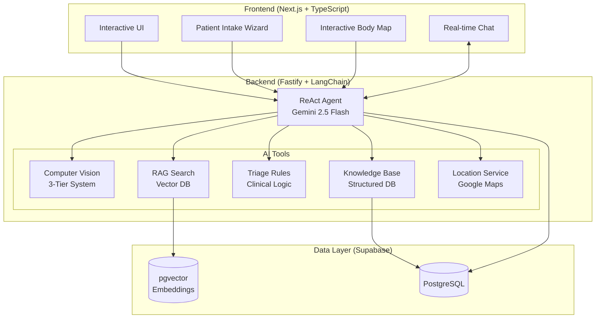

# Medagen - AI Medical Triage Assistant

> **Intelligent, accessible, and transparent medical triage powered by AI**

## 📋 Table of Contents

- [Problem Statement](#-problem-statement)
- [Solution](#-solution)
- [Unique Value Propositions](#-unique-value-propositions)
- [Architecture Overview](#-architecture-overview)
- [Quick Start](#-quick-start)
- [Documentation](#-documentation)
- [Technology Stack](#-technology-stack)

---

## 🚨 Problem Statement

### Healthcare Accessibility Crisis in Vietnam & Emerging Markets

Vietnam's healthcare system faces critical challenges that leave millions underserved:

**Access Barriers**
- **Rural-Urban Gap**: 70% of doctors concentrated in urban centers, leaving rural populations hours away from medical care
- **Overcrowded Facilities**: Major hospitals see 200-300% capacity, with average wait times of 3-4 hours for preliminary consultation
- **24/7 Coverage Gap**: Limited after-hours care outside major cities; minor emergencies often escalate unnecessarily

**Economic Burden**
- **High Consultation Costs**: $5-15 per visit (significant for rural families earning $100-200/month)
- **Transportation Costs**: Rural patients spend $10-30 just traveling to urban hospitals
- **Unnecessary Visits**: 40-50% of ER visits could be handled with proper triage guidance

**Information Challenges**
- **Medical Literacy**: Low health literacy rates make symptom interpretation difficult
- **Language Barriers**: Most medical information available only in English or technical Vietnamese
- **Fragmented Knowledge**: Patients struggle to distinguish between urgent vs. routine symptoms

**Technology Gap**
- **Limited Telemedicine**: Existing solutions require 4G connectivity (unavailable in 30% of rural areas)
- **No Visual Assessment**: Text-only systems inadequate for skin conditions, wounds, eye problems
- **Generic Solutions**: International platforms lack Vietnam-specific medical guidelines (Bộ Y Tế)

### The Cost of Inaction

Without accessible triage:
- ❌ Patients delay seeking care until conditions worsen
- ❌ Emergency rooms overwhelmed with non-urgent cases
- ❌ Healthcare costs remain prohibitively high
- ❌ Preventable conditions become severe emergencies

---

## ✅ Solution

### Medagen: AI-Powered Medical Triage for Everyone, Everywhere

Medagen democratizes healthcare access through **intelligent, transparent, and culturally-adapted AI triage**.

### Why Medagen Fits Vietnam & Similar Markets

**1. Smartphone-First Design**
- ✅ Works on basic Android devices (90% smartphone penetration in Vietnam)
- ✅ Progressive Web App - no app store required
- ✅ Optimized for 3G/4G with offline-capable fallbacks
- ✅ Low data usage (< 5MB per session)

**2. Visual & Accessible Interface**
- ✅ **Interactive Body Map**: Point-and-click symptom location (no medical terminology needed)
- ✅ **Image Upload**: Take photos of skin conditions, wounds, eyes for AI analysis
- ✅ **Multi-language**: Vietnamese-first, with English support
- ✅ **Low Literacy Support**: Visual icons, voice input ready

**3. Culturally & Medically Adapted**
- ✅ **Local Guidelines**: Integrated Vietnam Ministry of Health (Bộ Y Tế) protocols
- ✅ **Regional Context**: Understands common conditions in Southeast Asia (dengue, tropical diseases)
- ✅ **Cost-Aware**: Recommendations consider local healthcare costs and insurance coverage
- ✅ **Facility Mapping**: Integrated with Vietnamese hospital/clinic databases

**4. Transparent & Safe AI**
- ✅ **Explainable Reasoning**: Shows thought process (ReAct framework)
- ✅ **Multi-Source Verification**: Combines Computer Vision + Medical Guidelines + Clinical Rules
- ✅ **Safety Guardrails**: Never diagnoses, never prescribes - only triages
- ✅ **Clear Escalation**: Identifies red flags and directs to appropriate care level

**5. Free & Universally Accessible**
- ✅ **Zero Cost**: Free preliminary triage for all users
- ✅ **24/7 Availability**: Always accessible, no appointments needed
- ✅ **Session History**: Track symptoms over time
- ✅ **PDF Export**: Shareable report for doctor visits

### Impact Metrics We Target

| Metric | Goal | Impact |
|--------|------|--------|
| **Unnecessary ER Visits** | -30% | Saves $20-50 per avoided visit |
| **Time to Care Decision** | < 5 min | vs. 3-4 hours traditional triage |
| **Rural Access** | 100% | 24/7 access regardless of location |
| **Cost per Triage** | $0 | vs. $5-15 traditional consultation |
| **Languages Supported** | 2+ | Vietnamese, English (expandable) |

---

## 🎯 Unique Value Propositions

### 1. **Transparent AI Reasoning (ReAct Framework)**

Most AI systems are "black boxes." Medagen **shows its thinking**:

```
💭 Thought: Patient reports chest pain with radiation to left arm. 
           This is a red flag for cardiac emergency.

🔧 Action: Checking clinical guidelines for acute chest pain...

👁️ Observation: Guidelines confirm: chest pain + arm radiation = 
               emergency symptoms requiring immediate evaluation.

✅ Final Answer: EMERGENCY level triage. Call 115 immediately.
```

**Why it matters**: Users trust AI that explains itself. Healthcare professionals can verify the logic.

### 2. **3-Tier Specialized Computer Vision**

Not just one AI model - a **cascade of specialized experts**:

**Tier 1: Body Region Detection**
- Identifies anatomical area (chest, face, limb, etc.)
- Routes to appropriate specialty pathway

**Tier 2: Specialty Classification**
- Determines medical domain (dermatology, ophthalmology, wound care, oncology)
- Selects specialized model

**Tier 3: Pathology Detection**
- Runs deep analysis with domain-specific model
- Returns condition probabilities + confidence scores

**Example Flow**:
```
Image → [Detects: Skin/Leg] → [Routes to: Dermatology] 
      → [Analyzes: Rash patterns] → [Result: Eczema 78%, Fungal 15%]
```

**Why it matters**: Prevents misdiagnosis from using wrong model type. Higher accuracy than generic AI.

### 3. **Multi-Source Knowledge Integration**

Medagen doesn't rely on one source - it **triangulates truth**:

| Knowledge Source | Use Case | Example |
|-----------------|----------|---------|
| **Computer Vision Models** | Visual symptoms | Skin rashes, eye redness, wound assessment |
| **RAG (Vector Search)** | Medical guidelines | Bộ Y Tế protocols, WHO guidelines |
| **Clinical Rules Engine** | Red flag detection | "Chest pain + shortness of breath = Emergency" |
| **Structured Database** | Disease information | Symptoms, treatments, prevention |

**Validation Process**:
```
User Input (text + image)
  ↓
[CV Analysis: 80% Acne Vulgaris]
  ↓
[RAG Search: Finds matching guidelines]
  ↓
[Rules Engine: No red flags → Routine level]
  ↓
[LLM Synthesis: Creates coherent recommendation]
```

**Why it matters**: Cross-validation improves accuracy and safety. No single point of failure.

### 4. **Context-Aware Conversations**

Medagen **remembers**:
- Previous symptoms mentioned
- Images already analyzed
- Questions already asked
- Triage levels assigned

**Example Multi-Turn Conversation**:
```
Turn 1:
User: "I have a headache for 2 days"
AI: Assesses → Routine level, suggests rest

Turn 2:
User: "Now I have fever and stiff neck"
AI: REMEMBERS headache + NEW symptoms → 
     Escalates to URGENT (possible meningitis)
```

**Why it matters**: Symptoms evolve. AI must track changes and adjust recommendations dynamically.

### 5. **Real-Time Streaming with WebSocket**

Watch the AI work in real-time:
- See thoughts as they form
- Track tool usage (CV analysis, guideline search)
- Understand observation → conclusion flow

**Why it matters**: Builds trust through transparency. Users see the AI isn't guessing - it's reasoning.

---

## 🏗️ Architecture Overview



### Data Flow Example

**User Query**: "Red rash on arm, itchy for 3 days" + [uploads image]

```
1. Frontend → Backend:
   POST /api/health-check {
     text: "Red rash on arm, itchy for 3 days",
     image_url: "...",
     user_id: "user123"
   }

2. ReAct Agent Analyzes:
   💭 Thought: User reports skin condition with image. 
               Need visual analysis.
   
   🔧 Action: tool_cv_derm (image)
   👁️ Observation: [Dermatitis 65%, Eczema 25%, Fungal 10%]
   
   🔧 Action: tool_rag_search ("itchy red rash causes")
   👁️ Observation: [Guidelines: Contact dermatitis, atopic dermatitis...]
   
   🔧 Action: tool_triage_rules (symptoms)
   👁️ Observation: [Level: ROUTINE, no red flags]

3. Backend → Frontend:
   {
     triage_level: "routine",
     suspected_conditions: [
       {name: "Contact Dermatitis", confidence: "medium", source: "cv_model"},
       {name: "Atopic Dermatitis", confidence: "medium", source: "guideline"}
     ],
     recommendation: {
       action: "Over-the-counter hydrocortisone cream...",
       timeframe: "If no improvement in 5-7 days, see dermatologist",
       warning_signs: "If spreading rapidly, fever, or open sores → seek care"
     }
   }
```

---

## 🚀 Quick Start

### For Users

1. **Access**: Visit `medagen.app` (or local deployment)
2. **Start Assessment**: Click "Start Health Check"
3. **Describe Symptoms**:
   - Use interactive body map to point to pain areas
   OR
   - Upload photo of visible condition
   OR
   - Type symptoms in chat
4. **Get Triage**: Receive instant assessment with:
   - Urgency level (Emergency/Urgent/Routine/Self-care)
   - Possible conditions
   - Recommendations
   - Nearby medical facilities (if needed)

### For Developers

#### Backend Setup

```bash
# Clone repository
git clone <repo-url>
cd Medagen

# Install dependencies
npm install

# Configure environment
cp env.example .env
# Edit .env with:
# - GEMINI_API_KEY
# - SUPABASE_URL
# - SUPABASE_KEY
# - GOOGLE_MAPS_API_KEY

# Run backend
npm run dev
```

#### Frontend Setup

```bash
cd frontend

# Install dependencies
pnpm install

# Configure environment
cp .env.example .env
# Add NEXT_PUBLIC_API_URL

# Run frontend
pnpm dev
```

#### Access Points

- **Frontend**: `http://localhost:3000`
- **Backend API**: `http://localhost:7860`
- **API Docs**: `http://localhost:7860/docs`

---

## 📚 Documentation

### Core Systems

| Document | Description |
|----------|-------------|
| [Patient Intake System](./01-patient-intake-system.md) | Multi-step wizard, body map, form handling |
| [AI Triage Engine](./02-ai-triage-engine.md) | ReAct Agent, LangChain, Gemini integration |
| [Computer Vision System](./03-computer-vision-system.md) | 3-tier CV architecture for medical imaging |
| [RAG Knowledge System](./04-rag-knowledge-system.md) | Vector search, guideline retrieval |
| [Real-time Chat & WebSocket](./05-real-time-chat-websocket.md) | Streaming, session management |
| [UI Components Architecture](./06-ui-components-architecture.md) | Frontend design system |

### API Documentation

- **Swagger UI**: `/docs` endpoint on backend
- **OpenAPI Spec**: Available at `/docs/json`

---

## 🛠️ Technology Stack

### Frontend

| Technology | Purpose |
|-----------|---------|
| **Next.js 16** | React framework with App Router |
| **TypeScript** | Type safety |
| **Tailwind CSS** | Styling system |
| **shadcn/ui** | Component library |
| **Framer Motion** | Animations |
| **Zustand** | State management |
| **React Hook Form + Zod** | Form handling & validation |

### Backend

| Technology | Purpose |
|-----------|---------|
| **Fastify 5** | High-performance web framework |
| **LangChain 0.3** | AI agent orchestration |
| **Google Gemini 2.5 Flash** | Large Language Model |
| **Supabase** | PostgreSQL + Auth + pgvector |
| **@fastify/websocket** | Real-time streaming |
| **Axios** | HTTP client for CV models |

### AI/ML

| Component | Technology |
|-----------|-----------|
| **LLM** | Google Gemini 2.5 Flash (128k context) |
| **Embeddings** | Gemini text-embedding-004 |
| **CV Models** | Custom models via Gradio API |
| **Vector Search** | pgvector (cosine similarity) |

### Infrastructure

- **Database**: Supabase (PostgreSQL 15+)
- **Deployment**: HuggingFace Spaces (Backend), Vercel (Frontend)
- **Monitoring**: Pino logging
- **Documentation**: Swagger/OpenAPI 3.1

---

## 🎯 Project Status

**Current Version**: 2.0.0

**Core Features**:
- ✅ Patient intake wizard with body map
- ✅ ReAct Agent with multi-tool orchestration
- ✅ 3-tier Computer Vision system
- ✅ RAG-based guideline search
- ✅ Real-time WebSocket streaming
- ✅ Session-based conversation memory
- ✅ Triage report generation
- ✅ Location-based facility finder

**Roadmap**:
- 🔄 Offline-first PWA capabilities
- 🔄 Voice input for low-literacy users
- 🔄 SMS fallback for areas without internet
- 🔄 Integration with Vietnam hospital EMR systems
- 🔄 Expanded language support (Khmer, Thai, Indonesian)

---

## 📄 License

This project is private and proprietary.

---

## 🤝 Contributing

For internal development team only. See contribution guidelines in project wiki.

---

**Built with ❤️ for accessible healthcare in Vietnam and beyond**
